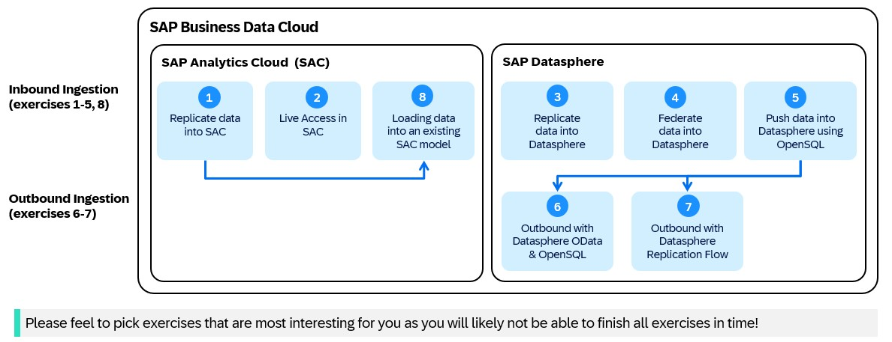

# DA260 - Connect third-party systems in SAP Business Data Cloud and SAP Datasphere

## Description

The SAP Business Data Cloud (BDC) solution enables smooth integration of SAP and third-party data. In this hands-on session, you explore different connectivity features in SAP Business Data Cloud (including SAP Datasphere & SAP Analytics Cloud), including setup, data acquisition, integration, and transformation—ideal for data engineers and architects.

This hands-on workshop gives you the opportunity to try out the different integration technologies that are part of the SAP Business Data Cloud offering.

SAP Business Data Cloud includes SAP Datasphere, a comprehensive data service acting as a business data fabric that enables every data professional to deliver seamless and scalable access to mission-critical business data. SAP Datasphere enables access to authoritative data by accelerating time-to-value through automatically reusing semantic definitions and associations from SAP applications. SAP Datasphere enriches all data projects by harmonizing heterogeneous data into a business semantic model of your diverse data landscape. In addition, it helps simplify the data landscape and access all your data across hybrid and cloud environments, no matter where it resides.

Additionally, SAP Business Data Cloud includes SAP Analytics Cloud (SAC), which enables users to visualize data, create interactive dashboards, and perform real-time reporting while supporting collaborative planning and forecasting. Furthermore, it includes capabilities to perform data integration and acquisition with a focus on self-service for business users, allowing them to easily acquire data from various different sources including SAP and third-party data sources.

**Important Note:**  
SAP Business Data Cloud also offers zero-copy sharing of data products with partners (e.g., Databricks) using the BDC Connect functionality. This is one of the fundamental and strategic approaches for SAP to allow seamless bi-directional access to data products, but this is out of scope for this hands-on exercise. You can find more information in the following session from [TechEd 2025](https://www.sap.com/events/teched/virtual/flow/sap/tev25/catalog-virtual/page/catalog/session/1751961499331001rRV1) as well as in the [BDC documentation](https://help.sap.com/docs/business-data-cloud/administering-sap-business-data-cloud/provision-sap-business-data-cloud-connector-for-supported-external-systems?locale=en-US).  
You will also find more information about the different announcements made during TechEd regarding the extended use of zero-copy sharing of data products for additional partners.

## Overview

* **Learning Goal:** Learn how to use various integration capabilities in SAP Business Data Cloud for integrating data from third-party data sources leveraging SAP Datasphere and SAP Analytics Cloud.

* **Estimated Time:** 2–4 h  

  **Important Note:**  
  Completing all exercises requires more time than the onsite workshop duration. Therefore, feel free to pick the exercises that are most interesting for you!

  For example, Exercise 1 offers great content for SAP Analytics Cloud with a detailed step-by-step guide and is one of the larger exercises in this hands-on session.

## Disclaimer

* Your screenshots may look different than those in the exercises due to new releases or enhancements.  
* Some user interface elements might differ from the screenshots used in the exercises.

## Requirements

* Chromium-based web browser  
* [Access to GitHub Repository](https://github.com/SAP-samples/teched2025-DA260)

  **Important Note:** The landscape used during SAP TechEd will be available until **November 29th**. Until then, you can reuse your existing content in your user space and finalize the exercises in case you did not have sufficient time during the workshop.

* [Access to SAP Datasphere tenant](https://trial-bdc-datasphere-3.eu10.hcs.cloud.sap/)  
* [Access to SAP Analytics Cloud tenant](https://trial-bdc-sac-3.eu10.sapanalytics.cloud/)

  * User-ID: AC248472Uxx, where XX are the last 2 digits assigned by the trainers onsite at SAP TechEd.  
  * Password: ObvAsy66By1!

* This is the intermediate level workshop. Basic know-how about using and integrating data in SAP Business Data Cloud with SAP Datasphere & SAP Analytics Cloud (SAC) is expected.
* General understanding of Enterprise Data Management and ETL (Extraction, Transformation, Load)

## Exercises

**Important Note:**  
Please choose the exercises that are most interesting for you! You will likely not be able to cover all exercises during the workshop. The arrows in the illustration below describe dependencies between exercises—for example, you need to complete Exercise 5 before performing Exercises 6 and 7.

A more detailed overview including the links to different exercises is provided below:

### Inbound integration

Please find below an overview of the different exercises.

| Product             | Replication | Federation | Push |
|---------------------|-------------|------------|------|
| SAP Analytics Cloud | [Exercise 1](exercises/ex1/), [Exercise 8](exercises/ex8/) | [Exercise 2](exercises/ex2/) | |
| SAP Datasphere      | [Exercise 3](exercises/ex3/) | [Exercise 4](exercises/ex4/) | [Exercise 5](exercises/ex5/) |

- [Exercise 1 - Replicate data into SAC](exercises/ex1/)  
- [Exercise 2 - Live connection in SAC](exercises/ex2/)  
- [Exercise 3 - Replicate data into SAP Datasphere with Replication Flows](exercises/ex3/)  
- [Exercise 4 - Federation in Datasphere with Remote Tables](exercises/ex4/)  
- [Exercise 5 - Push data into Datasphere with OpenSQL](exercises/ex5/)  
- [Exercise 8 - Loading Data into an existing SAC model](exercises/ex8/)  

### Outbound integration

| Product        | Pull | Push |
|----------------|------|------|
| SAP Datasphere | [Exercise 6](exercises/ex6/) | [Exercise 7](exercises/ex7/) |

- [Exercise 6 - Outbound pull of data in SAP Datasphere with JDBC or OData](exercises/ex6/)  
- [Exercise 7 - Outbound push in SAP Datasphere with Replication Flows](exercises/ex7/)  

Have fun!

## Contributing

Please read the [CONTRIBUTING.md](./CONTRIBUTING.md) to understand the contribution guidelines.

## Code of Conduct

Please read the [SAP Open Source Code of Conduct](https://github.com/SAP-samples/.github/blob/main/CODE_OF_CONDUCT.md).

## How to obtain support

Support for the content in this repository is available during the online session for which it was designed. Otherwise, you may request support via the [Issues](../../issues) tab.

## License

Copyright (c) 2024 SAP SE or an SAP affiliate company.  
All rights reserved.  
This project is licensed under the Apache Software License, version 2.0 except as noted otherwise in the [LICENSE](LICENSES/Apache-2.0.txt) file.
