# Exercise 1 - Exercise 1 Description

In contrast to Datasphere, where replication flows put data into tables that you can manipulate at will later on, data in SAC - whether acquired or federated - is always in the context of a semantic model.  Data can be added at the time of model creation, or added via load jobs later.  SAC models have automated table management, so the user simply worries about the semantic model and the required table schema is automatically created behind the scenes.

Note!  Data acquisition and replication are synonyms.

## Step 0

With SAC open, take a moment to orient yourself.  The navigation bar on the left side and the information bar along the top are shared across BDC tools, so if you know the basics of how to navigate in one, you know it for all.  

In the center canvas, you have some options.  There are four tabs, 
- **Today**: Where you can access tutorials, see files that you have recently opened and use AI to answer questions about your data.
- **Catalog**: Where you can access the data catalog.
- **Favorites**: Where you can see items that you have tagged as favorites.
- **Shared With Me**: Where you can see content that other users have created and shared with you.

Of course, you can also access everything through the various modules - Data Analyzer, Story Workbench, Modeling Workbench, etc. - in the navigation panel.  

To begin the exercise, select the Modeling Workbench, from the navigation panel.

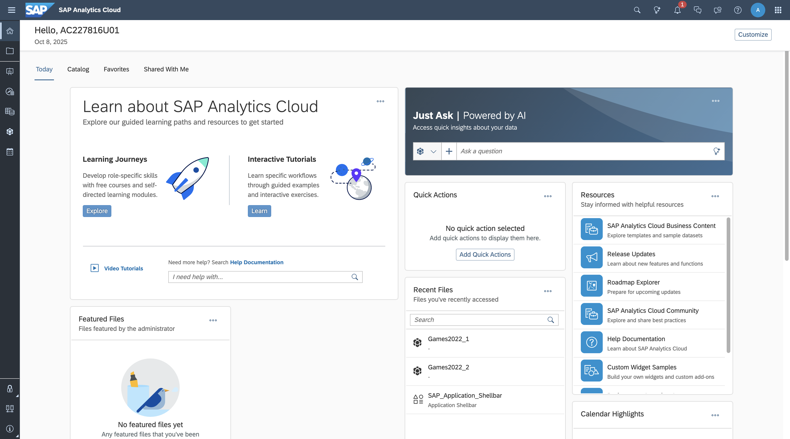

## Step 1

Take a moment to familiarize yourself with the layout of the Modeling Workbench's entry page.  You'll see:
- A list of models, created by you and created by others and shared with you.  This is where you can edit existing models.
- A button to create a new data model.  This is for the SAC data model (as opposed to the Datasphere or various remote model options).  Wherever the data is stored (acquired or live), the semantic model is in SAC.
- A button to create a new Live Data Model.  

The term **Live Data Model** can be confusing, because both model types allow for live data.
- **Live Data Model** really means "remote model with live data.  It is an alias for a BW Query, S/4 CDS View or HANA Calc View.  In this case, both the data and the semantic model are stored and managed in the remote system and SAC is simply acting as a consumer client.  This allows you e.g. to re-use the same queries in BW that your organization have re-used with many front end clients over the years and add them to stories, or analyze them in the Data Analyzer. You can't edit the remote model in any meaningful way from SAC and will have to use the tooling of the source system.

- **Data Model** can use both live and acquired data, depending on the source.  The semantic model always resides in SAC, it is edited from this module, but can only be used in SAC.  

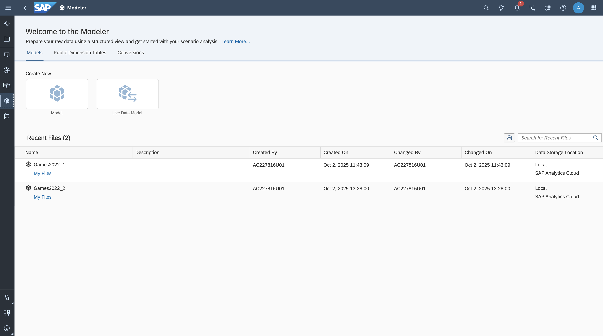

## Step 2

Click on **Data Model**, to begin creating a new data model.

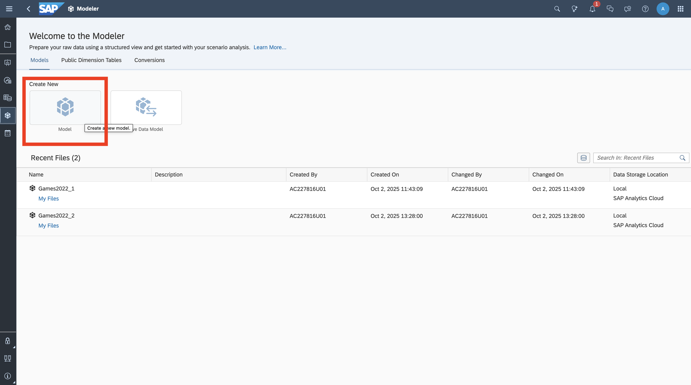

## Step 3

You can create models from data, or you can start with an empty model.

- **Start with Data:** In this mode, you will upload a file, or connect to data and the data table will be the starting point for your data modeling.  In short, you will design your model around the data that you have on hand.  This is also referred to as **data first modeling**. This is sometimes used for planning models, but it is most often associated with analytic scenarios.

- **Start an empty Model:** In this mode, you'll define the semantic structure of the model, while the fact table is still empty, and load data later.  It is conceptually akin to creating an SQL schema, as you'll define your columns, data types, which ones are measures and dimensions, which dimensions are single columns versus having a fully defined dimension table, etc. This is also referred to as **data first modeling**.

Select **Start with data** and then click **Next**.

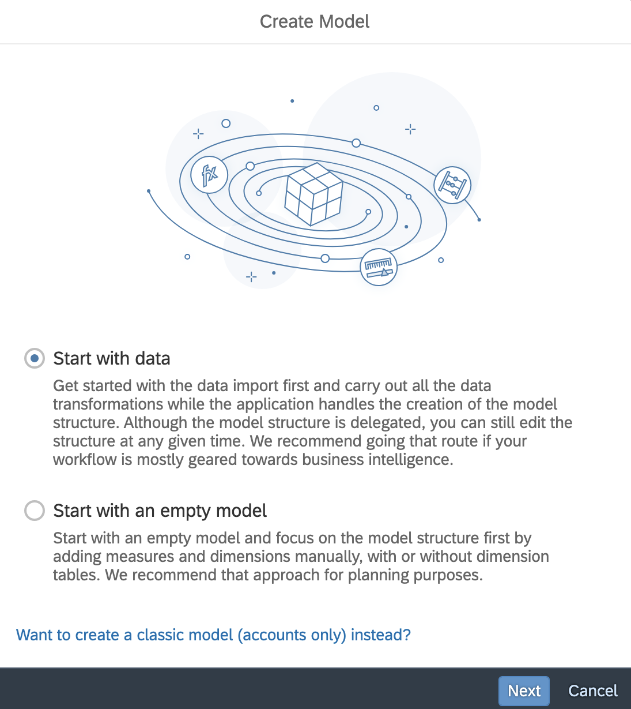

## Step 4

If you have configured your SAC tenant to use Datasphere as it's storage location, you have the option here to use that.  Making that configuration is not part of this exercise, so we will be using SAP Analytics Cloud as our storage location.  

Select **SAP Analytics Cloud** and click **Next**.

## Step 5

(This is just informative). If you had selected Datasphere, you'd select the appropriate space from a dropdown list.

**Do not do this**, as it is not properly configured.

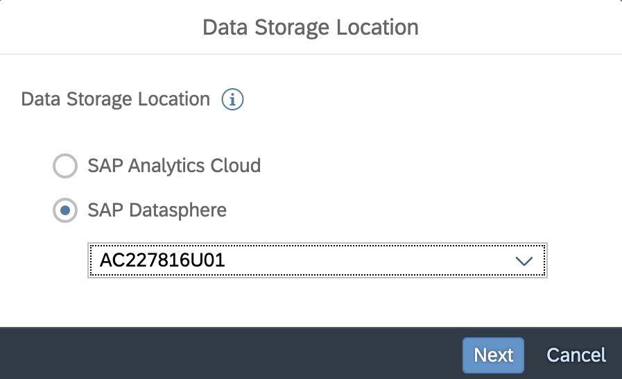

## Step 6

The data source selector has a search bar and two columns.  The left column is a list of available data sources.  The right side is a list of checkboxes, which can be used to filter the list on the left.  These checkboxes can be based on supported capabilities (e.g. sources that support live data or acquisition, cloud based or on-premise, etc.), vendor, etc.

Click the checkbox for **Google**, to filter the list down to Google sources.

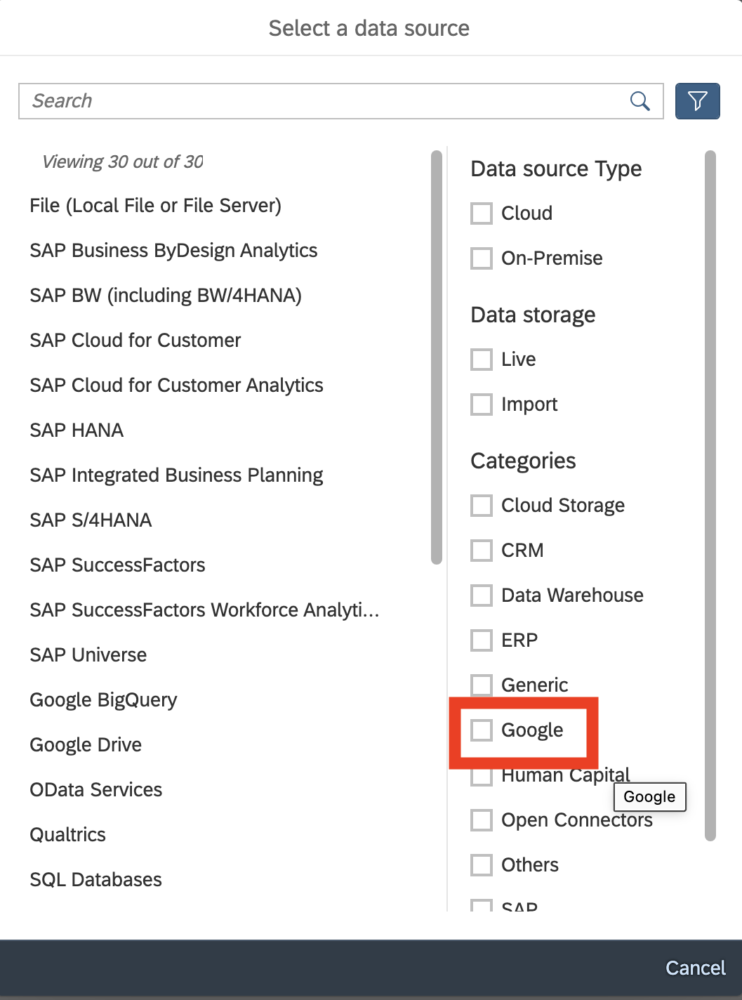

## Step 7

Notice that the list of data sources has been filtered to Google Drive and Google Big Query.

Click on **Google Big Query**, to proceed to the next step.

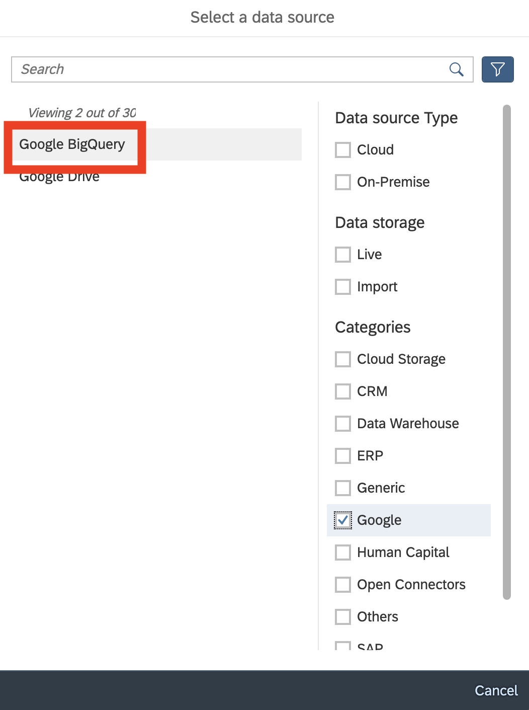

## Step 8

You will now see a dialog, asking you which connection you want to use.  Creating and maintaining connections to Google Big Query (GBQ) - configuring the URL, uploading the key file, etc. - is performed as a central administrative role.  This had been already been performed for you on this tenant, but if you wish to see how it is done, it is described in the help documentation, [here](https://help.sap.com/docs/SAP_ANALYTICS_CLOUD/00f68c2e08b941f081002fd3691d86a7/c67857c09b714f03b74464d00ef0c55b.html).

Select the connection GBQ and click **Next**.

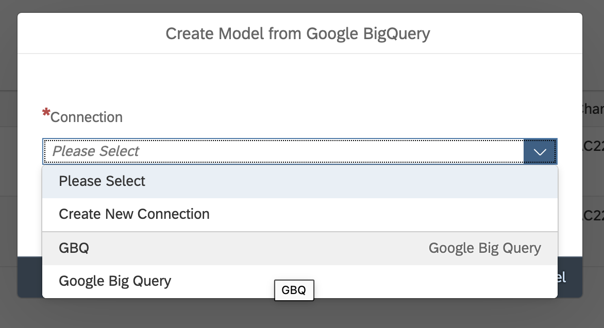

## Step 9

You have the option to create a new query, or select an existing one.  Select the option to create a new query and click **Next**.

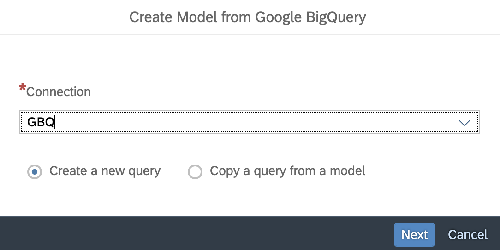

## Step 10

Since this exercise is about creating a model with acquired/replicated data select **Import Data** and click **Next**.

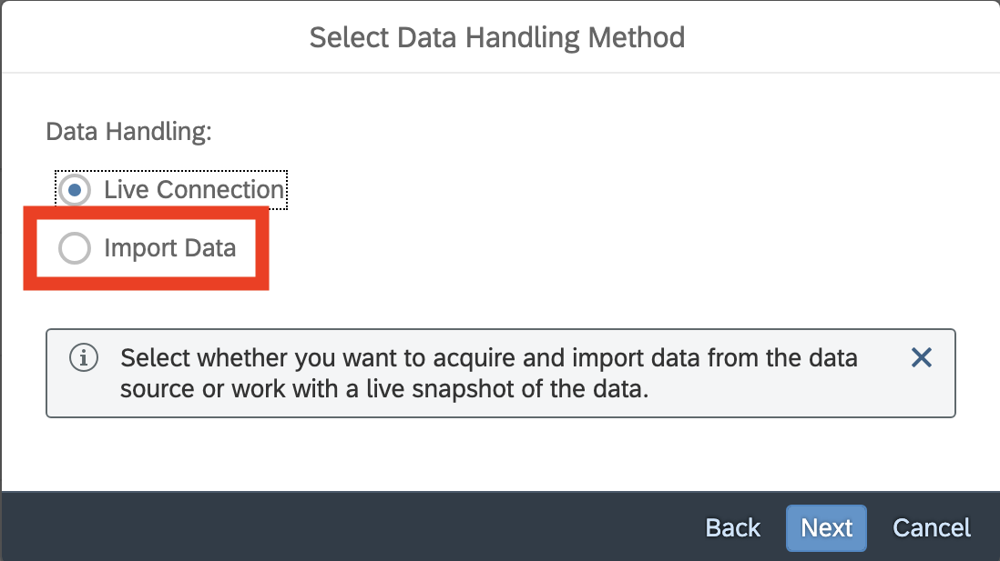

## Step 11

Give your query a name, for later reference.

Select **Build a Query** to access the visual query builder.

From the available tables in the GBQ project, select **World Cup > Games 2022**.

Click **Next**.

## Step 12

Take a moment to orient yourself in the query builder.  There are three areas, **Available Data**, **Selected Data**, and **Filters**.  **Selected Data** corresponds to the SQL "SELECT" and **Filters** corresponds to the SQL "WHERE", and **Available Data** lists all columns, as if you had executed an SQL "DESCRIBE" statement.   

Note!  All columns are in text format, even columns whose names indicate that they would have numeric values.  A well maintained table would have all of this information properly maintained at the source, and you'd see different data types.  We don't always have the luxury of - as is the case here.  Not to worry, we'll be able to fix that later!

Since we havent't seen the actual data yet and don't know which columns are useful or not, simply ass all to the selected data and click **Create**.

## Step 13

You'll be taken to the SAC modeling environment.  Your initial state will look like the screenshot below.  Take a moment to familiarize yourself.

Across the top menu, you'll see some meta function.  E.g. you can check validation, save, share, edit properties and access the other workspaces.  A few notes:
 - **Workspaces** allows you to enter specialized tools for maintaining model structure, managing the incoming load jobs and outgoing export jobs, and editing calculations.  Calculations do not alter any data in the table, but are computed dynamically when used.
- The table icon under **View** toggles the **Data Foundation** window on and off.  This shows the first 2000 records of your model's fact table, so that you can see what kind of data it has.  
- **Validation** is a critical tool.  It provides feedback on structural and metadata problems in the model.  E.g. if cells contain data in the wrong format for their declared data type, if a dimension member has no corresponding dimension table entry, etc. In this case, the error is because your model does not have any measures and a data model requires at least one measure.  Remember when we mentioned that the source data had only text data, even for columns that seemed like they should have numerical data?  All columns were initially imported as dimensions, so we'll have to fix these ins later steps.
**Model View** allows you to toggle between the (current) list vie and a graphical view more like a SQL schema diagram.  
**Properties**, in the General group, let's you manage advanced attributes of your semantic model.

In the details' pane, you can also access model properties and see the special properties configured for that model.  You can also see the data sources used by that model and the places where this model is used.  Since were setting up a new model based on an initial import, both of these will be empty for now.

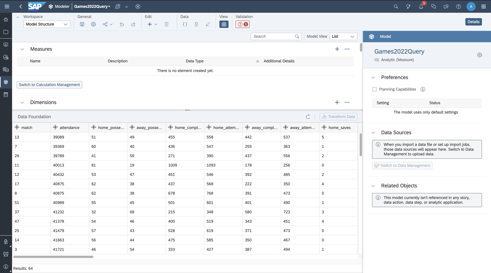

## Step 14

Click on **Validation**.

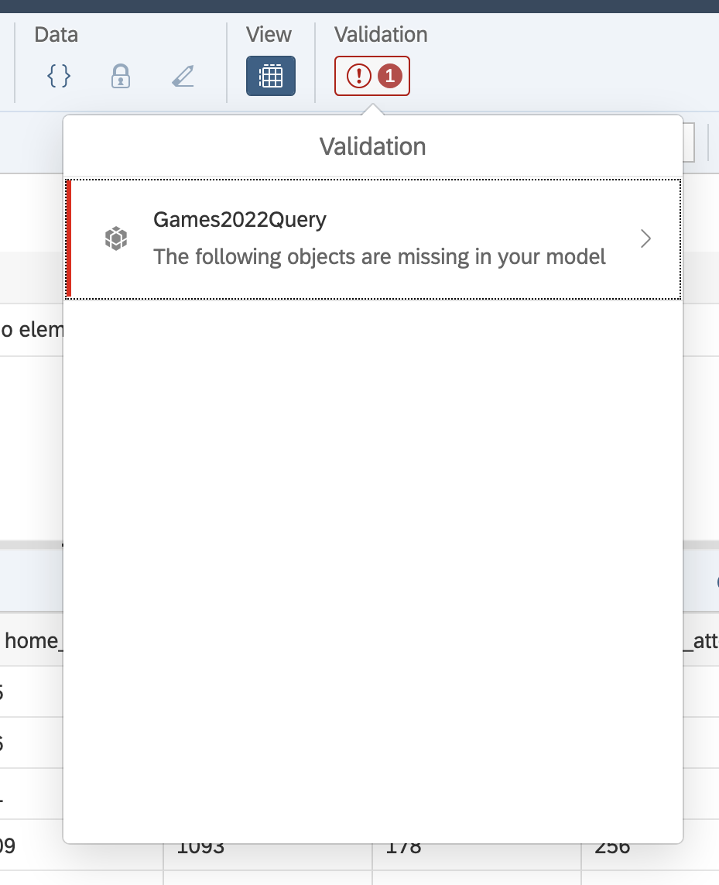

## Step 15

Click on the text where validation is telling you that **The following objects are missing in your model**.

Remember when we mentioned that the source data had only text data, even for columns that seemed like they should have numerical data?  All columns were initially imported as dimensions, so we'll have to fix this ins later steps.

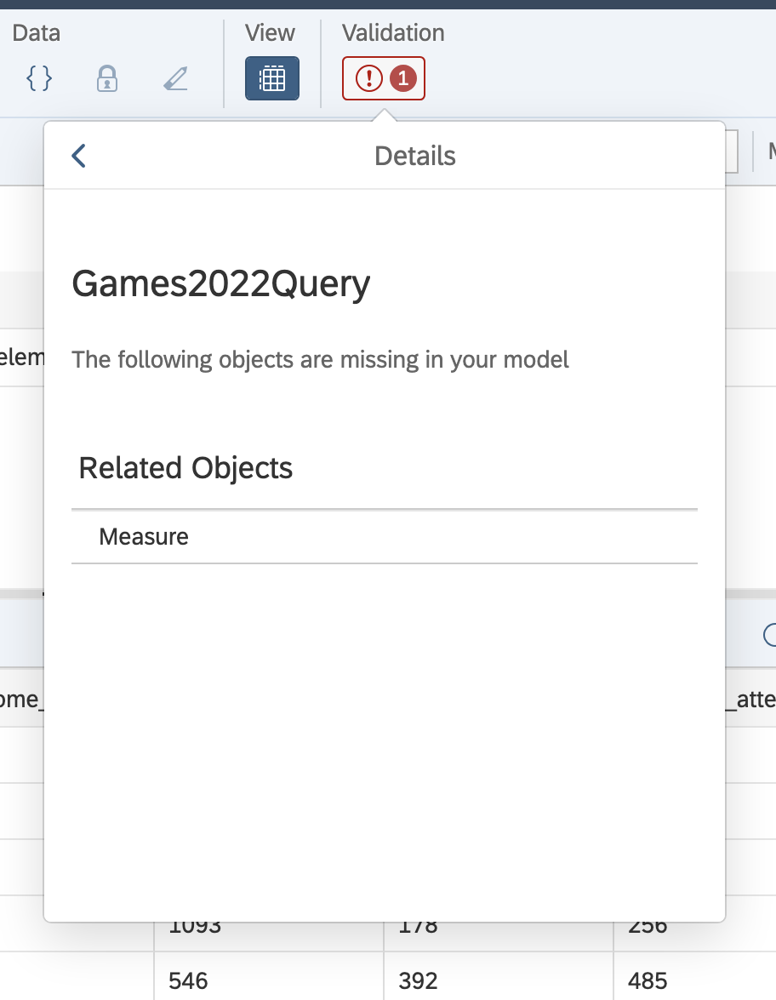

## Step 16

Toggle the **Data Foundation** window on and have a look at the data in your fact table.  This will be useful in the following steps.

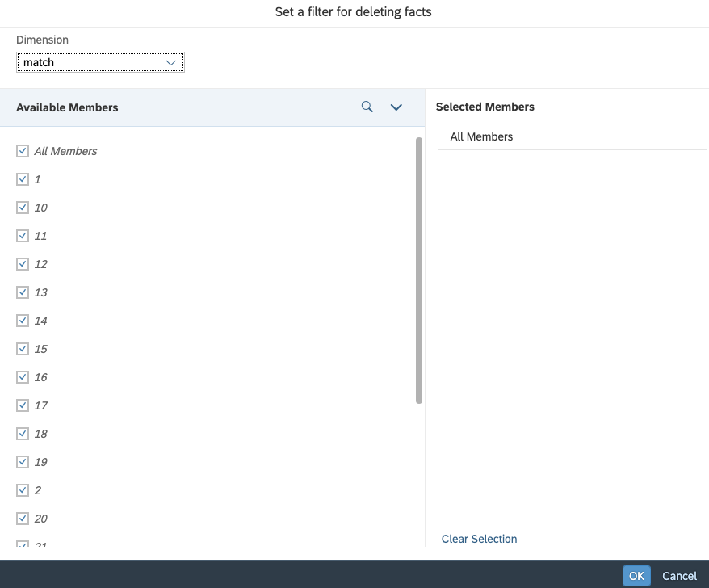

## Step 17

In the **Dimensions** area, click the checkboxes of columns that appear to maintain measure data.  Note!  All measures are numeric, but not all numeric values are measures.  A measure is specifically cardinal data; data suited for calculations.  Some numbers, such as the **Match** column are ordinal data and contain numbers used as identifiers.

## Step 18

Click any of the ellipses in the right column of the Dimension table and select **Convert to Measure**.

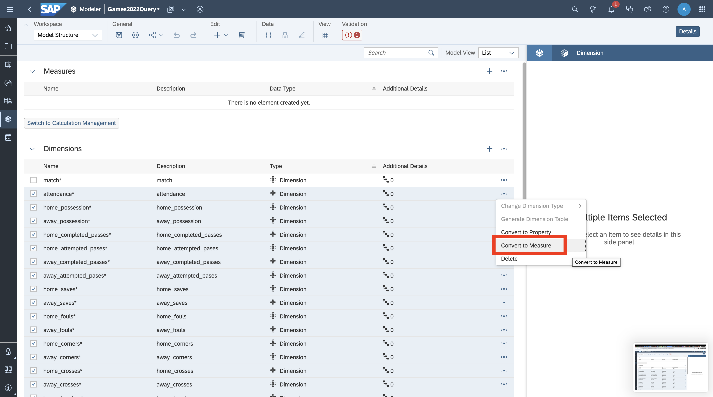

## Step 19

Select **Integer**

You can leave the conversion format alone.

Click **OK**.

## Step 20

You will now see these columns in the **Measures** area and the validation error will be gone.

## Step 21

Scroll down and have a look at which columns are measures and which are dimensions.  Feel free to toggle the **Data Foundation*** view back on and double check that the columns are all properly allocated to Dimensions and Measures.

## Step 22

Save your model.

Name it **Teched2025-DA260_Ex1_Games2022** and click **OK**.

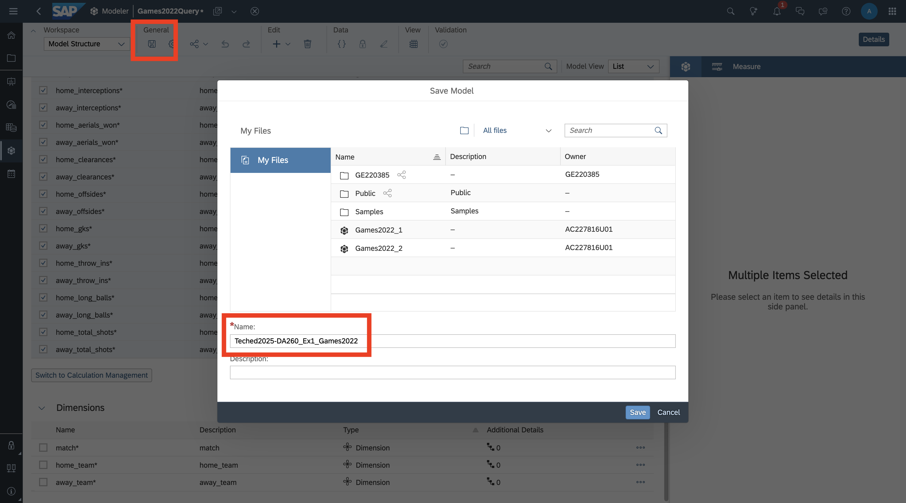

## Step 23

Before leaving the Modeling module, navigate to the **Data Management** Workspace.

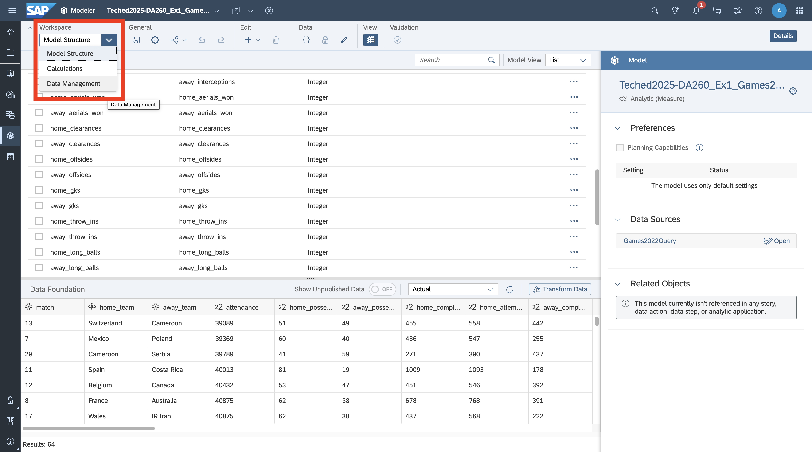

## Step 24

Here, you can see and manage the data flowing into and out of your data model.  In the **Import Jobs** section, you'll see a single import job, which was created when your model was created.  A model can have any number of load jobs, feeding its fact and dimension tables.  Here, you can see:
- The name of the Query.
- Where the data is coming from.
- If it is a scheduled job, you can see that information.
- When the last load job ran.
- The status of the import setup.  Right now, it says that "import hasn't been run yet".If you click on Set Up Import, you'll be able to enter wrangling (data prep), map remote data columns to model measures and dimensions and run the job to load the data into the model.  This isn't needed now, though you may want to set up the import and schedule it, if you want to keep the model updated with any changes in the source system.  It is absolutely needed, when you create a load job for a model that already exists.
- Under the ellipsis, you can edit the wrangling and mapping for the model.

For load jobs that have been run, you can see how many rows were imported with successful imports, if any failed and how many rows were rejected as invalid on successful imports.  In case you were wondering why you'd want to edit the wrangling and mapping of existing load jobs, fixing rejected rows is the usual reason.

In the **Export Jobs** section, you can see the same for export jobs.  Scheduled push exports can be configured for certain targets; e.g. File, BW and S/4.

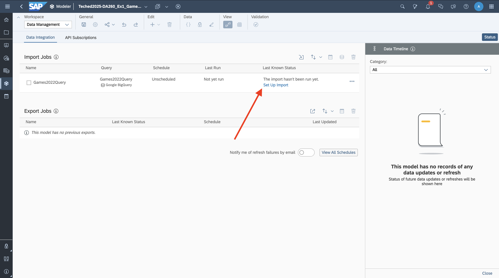

## Step 25

Now we'll have a look at your new model.

From the Navigation bar, open the Data Analyzer.

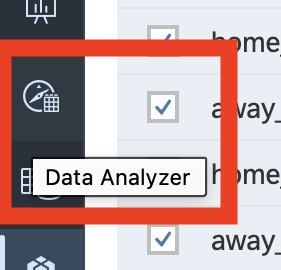

## Step 26

Close the **Release Highlights** popup, if it appears.

## Step 27

Select your model, **Teched2025-DA260_Ex1_Games2022**.

## Step 28

Add **away_team**, **home_team**, and **match** to the rows.

Add **attendance** to the columns.  You see your first SAC model in action.

Feel free to modify your view and explore the data a bit.

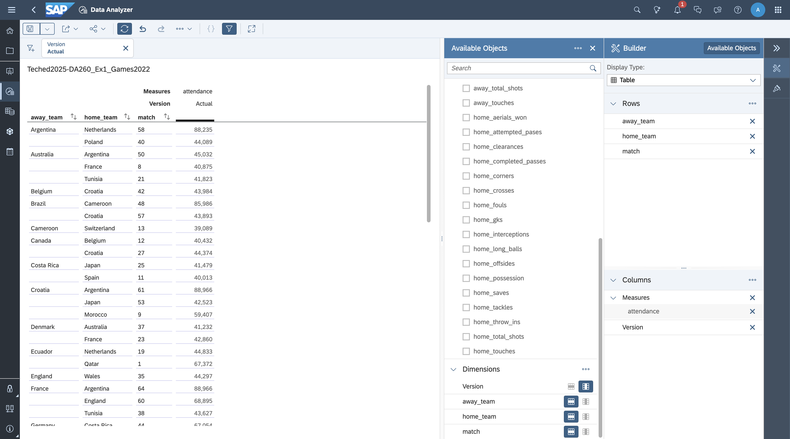

## Summary

You've now created a new model in SAC by importing data.  

