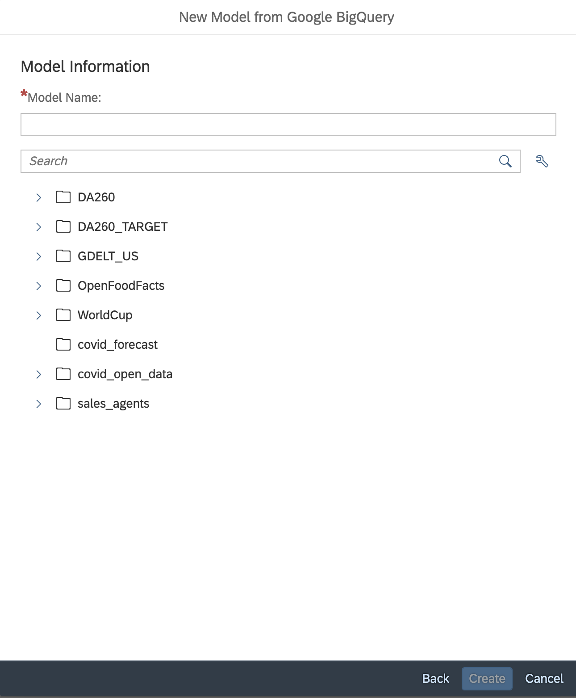
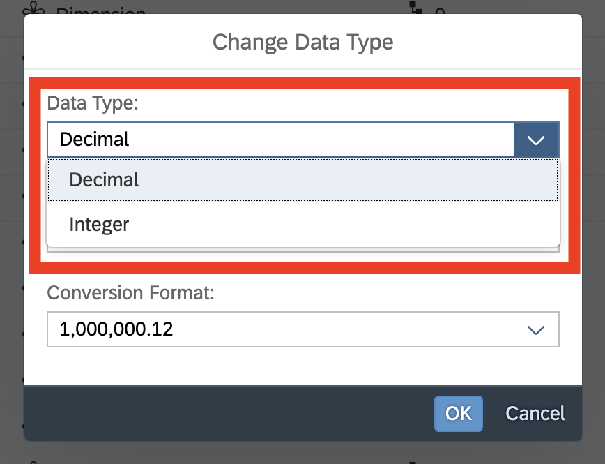

# Exercise 2

In Exercise 1, you created a model in SAC data acquired from a Google Big Query (GBQ) project.  In this exercise, you will create another data model, using the same data from GBQ, but this time in live data access model.  Together, Exercises 1 and 2 show you the similarities and differences between working with replicated and federated data in SAC models.  

## Step 1

Repeat **Step 1**, through **Step 5**, from **Exercise 1**.  In **Exercise 1.6**, you filtered for Google sources.  That would work here, because we will be using the same GBQ table, but this time, we're going to use different filters, to shorten the list of available data connections.  

Click the **Live** checkbox, to shorten the list to sources that support live data connectivity.  Right now (Q4 of 2025), it is only Google Big Query.  In Q1 of 2026, we will add Snowflake and Microsoft Azure, with other to follow.

## Step 2

XXX

## Step 3

XXX

## Step 4

XXX

## Step 5

XXX

## Step 6

XXX

## Step 7

XXX

## Step 8

XXX

## Step 9

XXX

## Step 10

XXX

## Step 11

XXX

## Step 12

XXX

## Step 13

XXX

## Step 14

XXX

## Step 15

XXX

## Summary

You've now ...

Continue to - [Exercise 2 - Exercise 2 Description](../ex2/README.md)

