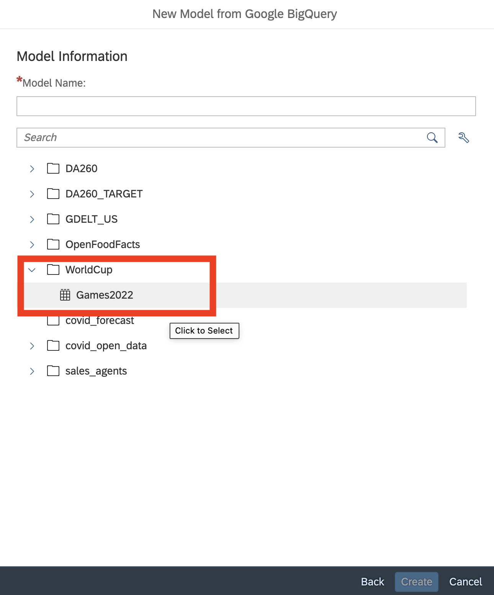
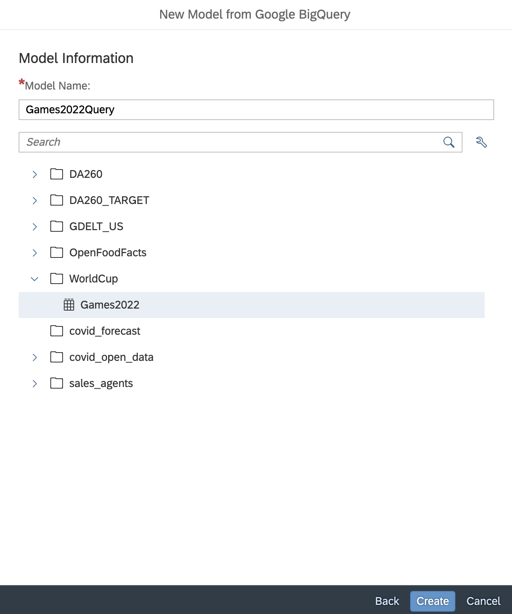
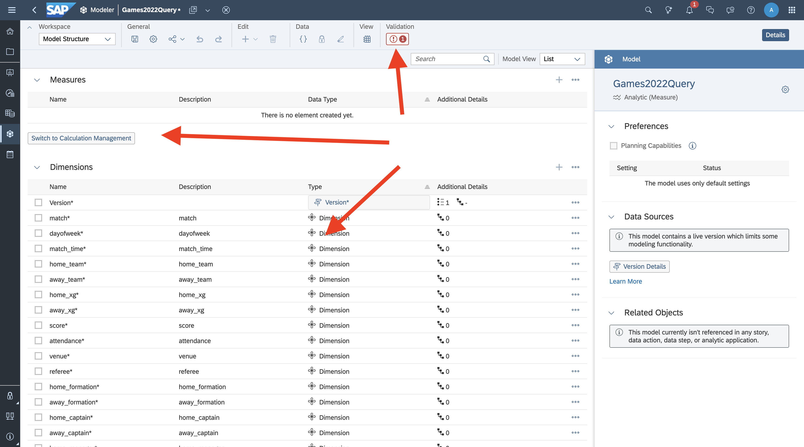
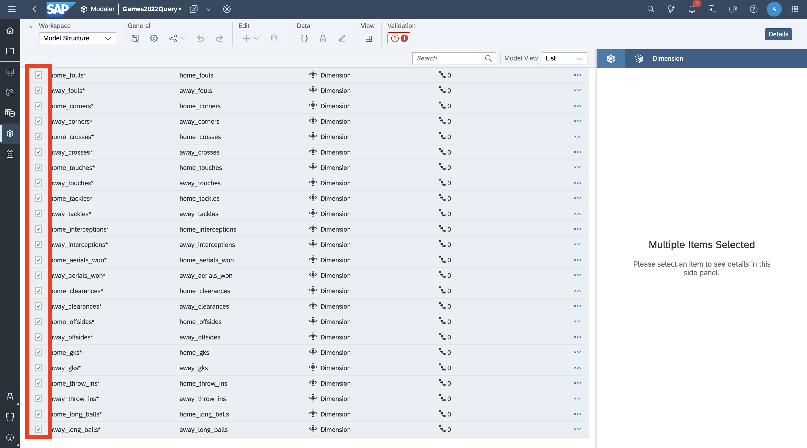
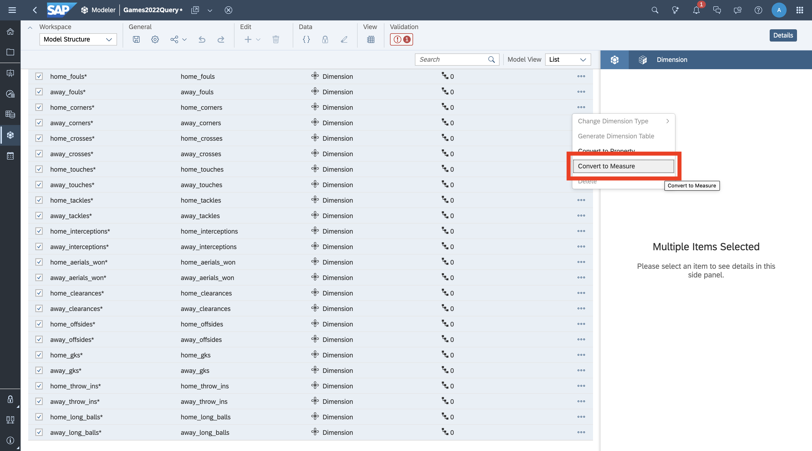
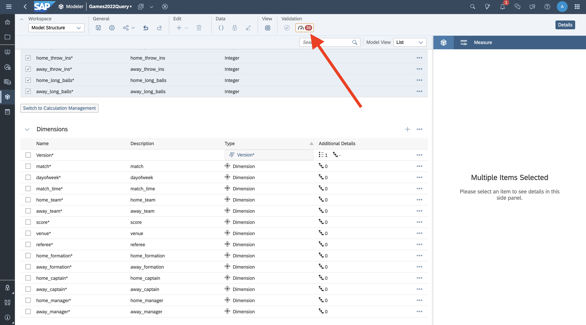
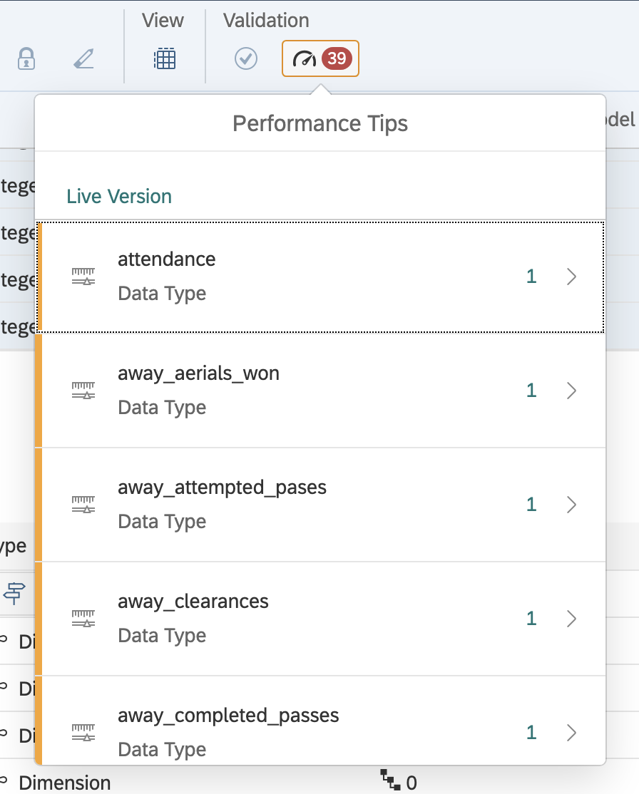
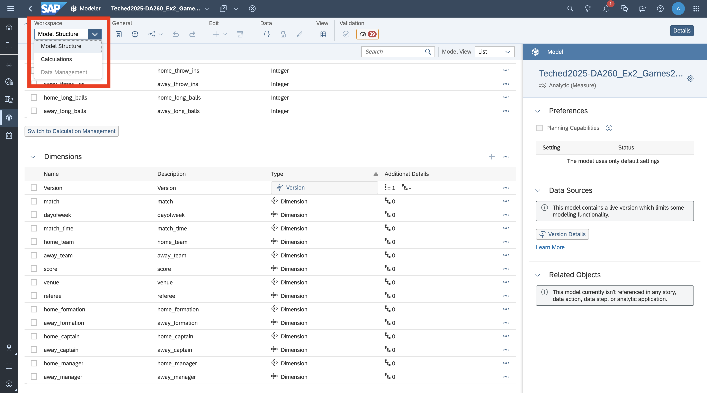
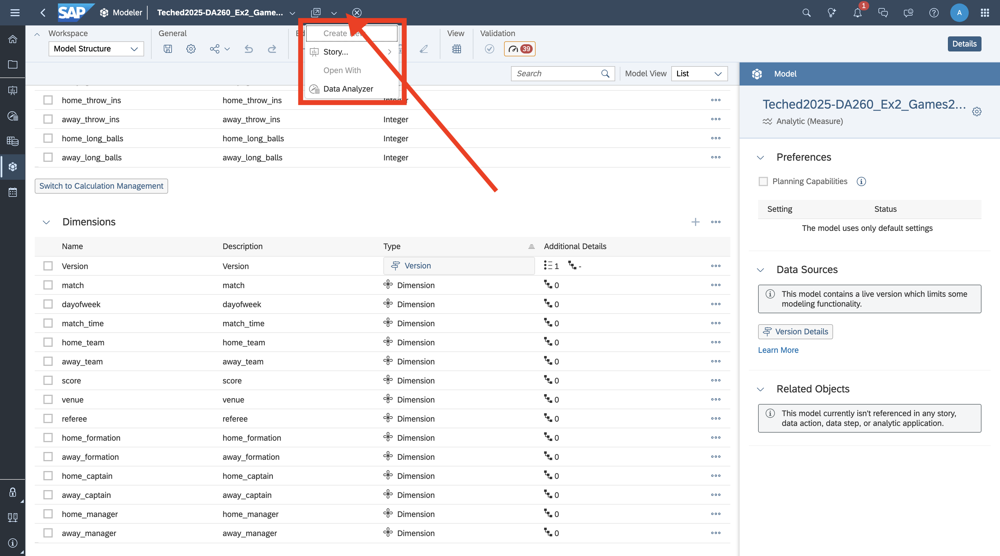
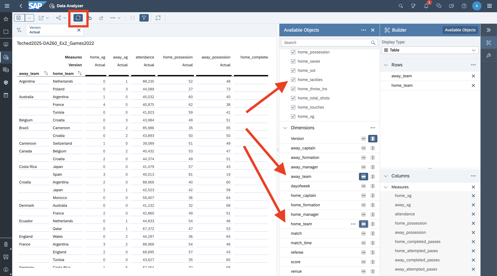

# Exercise 2 - Analytics Cloud Model with Live Data

In Exercise 1, you created a model in SAC data acquired from a Google Big Query (GBQ) project.  In this exercise, you will create another data model, using the same data from GBQ, but this time in live data access model.  Together, Exercises 1 and 2 show you the similarities and differences between working with replicated and federated data in SAC models.  

## Step 1

Repeat **Step 1**, through **Step 5**, from **Exercise 1**.  In **Exercise 1.6**, you filtered for Google sources.  That would work here, because we will be using the same GBQ table, but this time, we're going to use different filters, to shorten the list of available data connections.  

Click the **Live** checkbox, to shorten the list to sources that support live data connectivity.  Right now (Q4 of 2025), it is only Google Big Query.  In Q1 of 2026, we will add Snowflake and Microsoft Azure, with other to follow.

## Step 2

This time, in the Data Handling Dialog, you will select **Live Connection**, before clicking **Next**

## Step 3

Select **World Cup > Games 2022**.

## Step 4

You'll need to assign a model name.  By default, it is the name of the table, concatenated with "Query".  You'll have another opportunity to name it when saving it, but go ahead and name it **Teched2025-DA260_Ex2_Games2022**.

## Step 5

Query design is skipped, and you go straight to the modeler.  As with the import use case, take a moment to orient yourself in modeling.  

- Recall that the table only has text values, so all columns default to dimensions, and you'll need to sort them out again.
- Recall that there is one validation error, because the model has no measures to start with.
- Note that because there is no query builder step, all columns in the remote table are in the model.  

## Step 6

Just as is **Exercise step 1.17**, click the checkboxes of columns that appear to maintain measure data.  

- Remember!  All measures are numeric, but not all numeric values are measures.  A measure is specifically cardinal data; data suited for calculations.  Some numbers, such as the **Match** column are ordinal data and contain numbers used as identifiers.

## Step 7

Just as in **Exercise Step 1.18**, click any of the ellipses in the right column of the Dimension table and select **Convert to Measure**.

## Step 8

Just as in **Exercise Step 1.19**, choose to convert to Integer and you can leave the conversion format alone.

## Step 9

Note that you suddenly have many validation issues!

## Step 10

Open the data validation drop worn.  Note that there are no actually validation errors anymore, and the model is perfectly usable.  However, there are many performance tips.  Specifically, every column with a data type change is called out.  What is going on?  Simply put, certain things can be pushed down into the original query and certain things are processed in SAC's OLAP engine.  Anything that requires compute on the SAC side will get called out.  The data type conversion is a relatively harmless one, but is still called out.  This is a connectivity hands-on and not a data modeling hands-on, so we're leaving the model in a relatively simple state.  If we were going certain things, such as assigning dimension columns to public dimensions that contain parent child hierarchies, the impact would be more noticeable.  

More information on the performance considerations of using live data in models can be found in the SAC documentation, [here](https://help.sap.com/docs/SAP_ANALYTICS_CLOUD/00f68c2e08b941f081002fd3691d86a7/2236676398d342619022bc21d76d922a.html).

## Step 11

Before continuing, navigate to the **Workspace** dropdown and not that the **Data Management** workspace is disabled.  

**Note!**

With QRC release 2025.Q4, you will be able to [use live data in specific versions of planning models](https://roadmaps.sap.com/board?PRODUCT=67838200100800006884&range=CURRENT-LAST#;INNO=000D3AAADBCE1FE092F208D69E93ABB6).  Any analytic model (so without planning enabled) will still have a disabled **Data Management** workspace.  Any planning enabled model will also have a disabled **Data Management** workspace, *until you have entered version management in a story and added versions*.  If you plan on mixing live and acquired data in a single model, you will need to create the model with live data as in this exercise, so that the **Actuals** version is live.  All planning versions will use acquired data only.

## Step 12

Go ahead and save your model.

In Exercise 1, you went to the **Data Analyzer** module, to open the model.  You can also open the model in the **Data Analyzer**, directly from the Modeling module.  Look across the very top of the screen, just to the left of the model name.  Notice the pull down menu.  If you open this, you'll see the option to start creating a new story, using this model, or to open it in the **Data Analyzer**

Use the pull down to open the model in the **Data Analyzer**.

## Step 13

Use the builder to analyze the available data.  Note that whenever you change the dimensions and measures in the rows and columns, or alter a filter, a new query is sent to GBQ.  This gives you the current data in the remote table, for the current view.

**Tip!**  If you are making a batch changes to the view, at the same time, you can toggle auto-refresh off and toggle it back on after you have made you batch of changes.  This prevents constant query round-trips from happening while you are making your batch of changes.

## Summary

You've now ...

Continue to - [Exercise 3 - Replicate Files from Google Cloud Storage (GCS) via Replication Flows to SAP Datasphere](../ex3/README.md)

