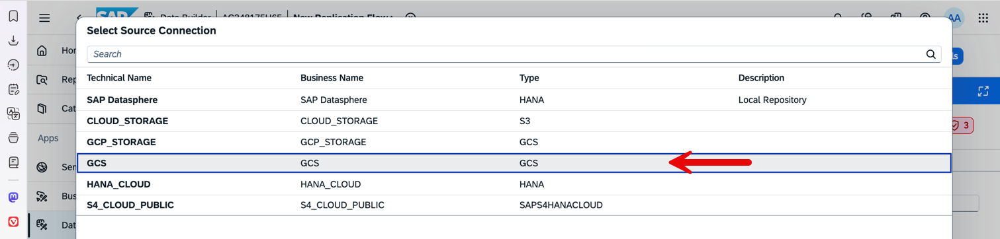
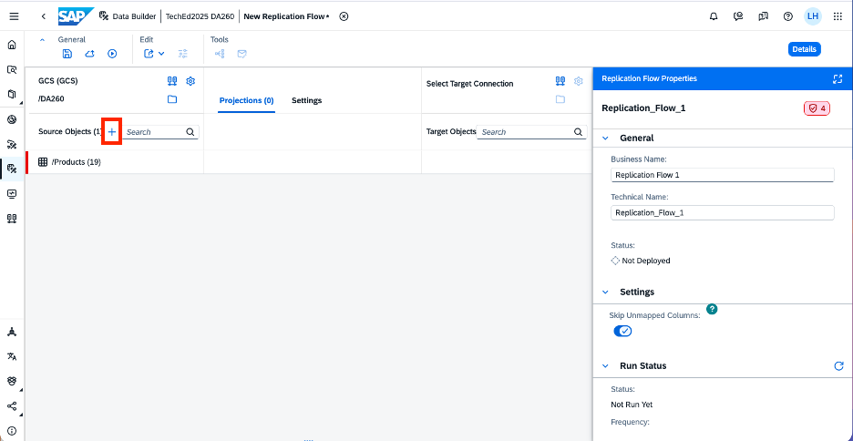
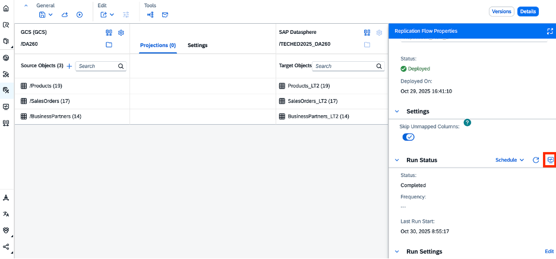
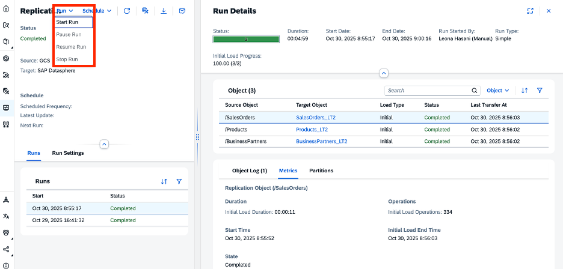
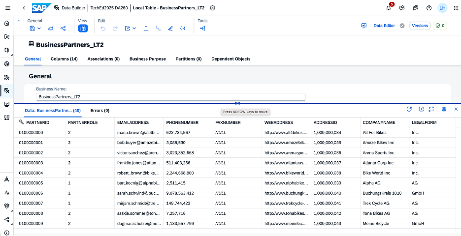

# Exercise 3 - Replicate Files from Google Cloud Storage (GCS) via Replication Flows to SAP Datasphere

This exercise involves creating a Replication Flow that reads data from Google Cloud Storage (GCS) CSV files and replicates this data into SAP Datasphere local tables. This process involves modeling a replication flow and configuring it to consume a pre-existing GCS connection and pick the required source objects to copy them into new target tables in SAP Datasphere.

In this exercise we will make use of connections that are pre-delivered in your SAP Datasphere instance, e.g., the Google Cloud Storage (GCS) connection. You can check the GCS connection in the **Connections** application inside your SAP Datasphere space.

The task is to load the CSV views from Google Cloud Storage for:
- Products  
- Sales Orders  
- Business Partners  

into SAP Datasphere.

Refer to the provided solution below for a detailed, step-by-step guide to complete Exercise 3.

1. Open your SAP Datasphere using the provided credentials. Your user is associated with a default space that has the same name as your user, where you can work and create your various data artifacts like the replication flow.

   

2. Click on the **Data Builder** and select your space to see the Data Builder homepage as shown below, where you can see the **New Replication Flow** tile.

   

3. Click on the **New Replication Flow** tile to launch the creation of a new replication flow.

   

4. Click on the **Select Source Connection** button to launch a popup window where you can select the source connection.

   

5. Select **GCS**, which is using the connection type GCS (Google Cloud Storage), from the list of available connections. The connection will update, and the **Select Source Container** button will be automatically selected for the next step.

   

6. Click on the **Select Source Container** button to launch the container selection popup. Then click on **DA260** and select **Select**.

   

7. After selecting **DA260**, you will see that the container is updated in the upper-left part of the Replication Flow screen.

   

8. Click on the **Add Source Objects** button to launch the Select Source Objects popup.

   This window lists all files inside the selected container. Select the following CSV files:
   - *Products*  
   - *SalesOrders*  
   - *BusinessPartners*

   Please remember that you must repeat this step for each CSV file you want to add.

   

9. After selecting **Products**, a new window will open. Select the file named `Products.csv` and click **Next**.

   

10. Click **Add Selection**...

   

   ...which starts the fetching of source object details.

   

   After adding the `Products.csv` file, click the **+** button to add the other two source objects (`BusinessPartners.csv` and `SalesOrders.csv`), as shown below:

   

   Repeat steps 9–10 for the remaining files.

11. The three selected CSV files are now added to the Replication Flow:

   

12. You will see red notifications next to each Source Object.

   Select each dataset to open the **Object Properties** window on the right. Scroll down and select **Configure Schema**.

   A new popup window opens, displaying various properties for the CSV file. For this exercise, do not change these properties; leave them as they are.

   Make sure **UTF-8** is selected for Encoding. Click **Apply Changes**, then select the checkbox for the **Primary Key** column (each file should have an `ID` column). Click **Save**.

   

   

   **Note:** Repeat these steps for the other two CSV files to remove all red notifications.

13. You have the option to create projections for each CSV file, but no projections are required in this exercise.  
   As the next step, click the icon next to **Select Target Connection**.

   

   In the popup window, select **SAP Datasphere** as the target connection.

   

14. The target connection details are now updated in your Replication Flow. The target container is automatically set to the space your user is logged into. The highlighted section shows the new target local tables that will be created in SAP Datasphere and used as the data sink for replication.

   

15. For each of the target objects, click the **...** menu and select **Rename Target Object**:

   

   Rename `Products` to `Products_LT`, `BusinessPartners` to `BusinessPartners_LT`, etc.  
   In this scenario, you allow the replication flow to create the target local tables instead of using existing ones.

   

   **Note:** Replication flows can also write into pre-existing target tables. You can map to existing tables using the three-dot menu. Tables that don't yet exist appear slightly transparent and italicized.

16. Click the **Deploy** icon  in the top toolbar to launch the Save popup:

   

   Change the default name to **Inbound Replication Flow**, which automatically sets the technical name to `Inbound_Replication_Flow`.

17. After deployment, click the **Run** button . Check the status in the Properties Panel. It will start as *Not Deployed* and change to *Deployed* after a few seconds.

   

   **Note:** A popup notification will appear once the deployment finishes, and you can also check notifications in the top-right corner.

   

18. Click the **Monitor** icon  in the Run Status tab or in the Replication Flow Properties panel to navigate to the monitoring screen:

     
   

   Here you can see information such as source and target connections, load statistics, and replication status.

   

   You can start/pause/resume/stop the run using the three-dot menu. If the replication flow has not yet completed, click **Refresh** as shown below:

   

19. Once completed, you can check the replicated data in the Datasphere local tables. Go to the main page of the **Data Builder** and locate the tables created by the Replication Flow:

   

   Then select one of the local tables, e.g., **`BusinessPartners_LT`**, by clicking it once.

   Click the **Preview** button:

   

   

   After a few seconds, you will see the replicated data from Google Cloud Storage containing Business Partner information.

**This concludes Exercise 3, where the objective is to replicate data from Google Cloud Storage into SAP Datasphere.**

Continue with [Exercise 4 - Federation in Datasphere with Remote Tables](../ex4/).