# Exercise 3 - Replicate Files from Google Cloud Storage (GCS) via Replication Flows to SAP Datasphere

This exercise involves creating a Replication Flow that reads data from a SAP S/4 HANA CDS Views and replicates this data into SAP Datasphere local tables with delta capture as target. This process involves modelling of a replication flow and configuring it to consume a pre-existing S4 HANA connection and pick the required source objects to copy them into new target tables in SAP Datasphere.

In this exercise we will make use of connections that are pre-delivered in your SAP Datasphere instance, e.g. the SAP S/4HANA on Premise source system. You can check the the S/4HANA connection in the “Connections” application inside your SAP Datasphere space.

The Task is to load the CDS Views for
- Business Partner -  Z_CDS_EPM_BUPA
- Product - Z_CDS_EPM_PD
- Sales Order - Z_CDS_EPM_SO
- Sales Order Items - Z_CDS_EPM_SO_I

in delta mode into Datasphere. The delta mode is required to setup the historic price derivation in the transformation flow later

Step by Step guide:
Refer to the provided solution below for a detailed, step-by-step guide to complete Exercise 1.

1.	Open your SAP Datasphere using the provided credentials. Your user is associated with a default space that has the same name as your user where you can work and create your various data artifacts like the replication flow.
   
    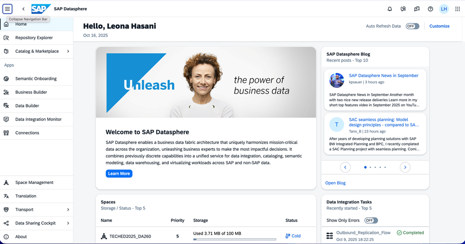

2.	Click on the Data Builder to see the Data Builder homepage as shown below and you can see *New Replication Flow* tile.
   
    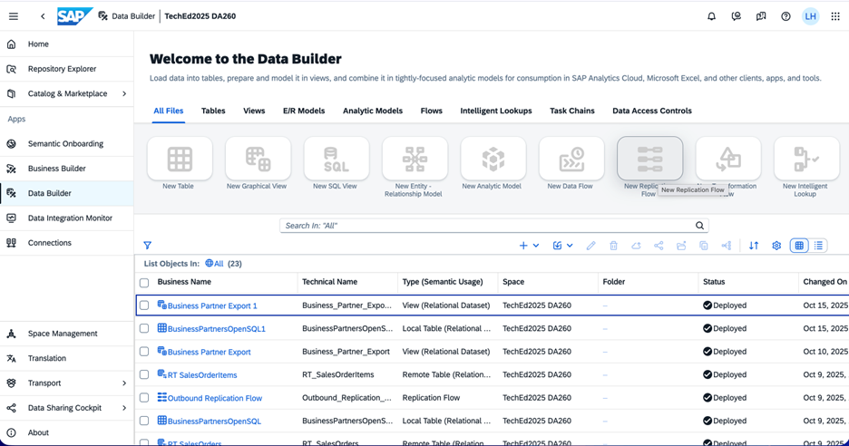

3.	Click on *New Replication Flow* tile to launch the creation of new a replication flow.
   
    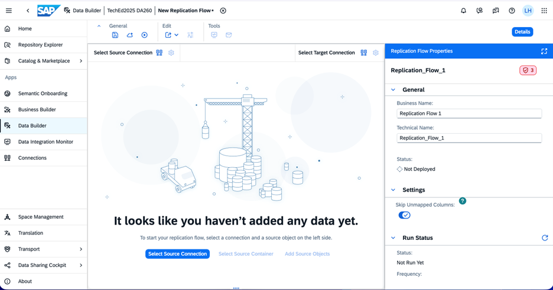

4.	Click on *Select Source Connection* button that launches a popup window to select the source connection.

    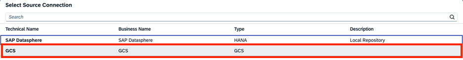

5.	Select GCS (Google Cloud Storage) which is using connection type GCS from the list of the available connections. It will update the connection and *Select Source Container* button is auto selected for the next step on the bottom of the screen highlighted in blue.

    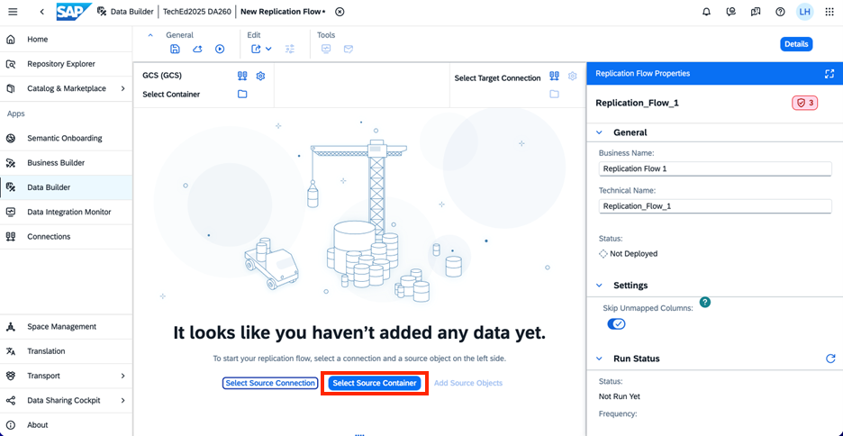

6.	Click on ‘Select Source Container’ button and it launches the Select Container popup. Then click on the *DA260*.

    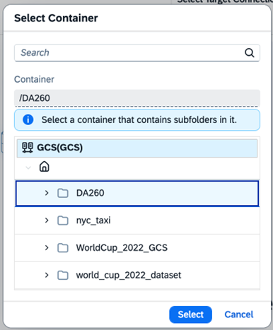

7.	On selecting *DA260*, you will see that the container is updated  in the Replication Flow upper left part of the Data Builder screen.

    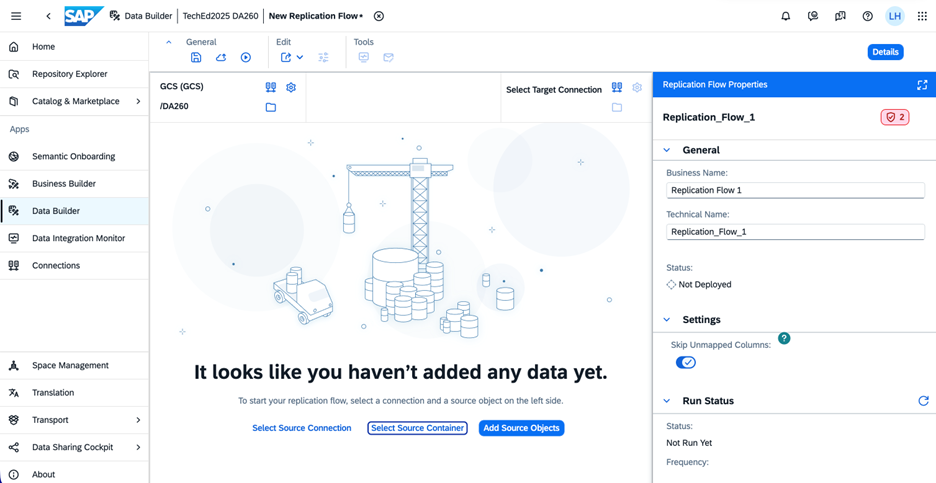

8.	Now click on *Add Source Objects* button that launches Select Source Objects as shown below. This will open a popup window which lists all the files that are in that object. Now, please select all the following csv files as shown below::
    
-   Products  
-	ProductTexts  
-	Addresses  
-	Employees  
-	SalesOrders  
-	BusinessPartners  
-	ProductCategories  
-	ProductCategoryText  

    

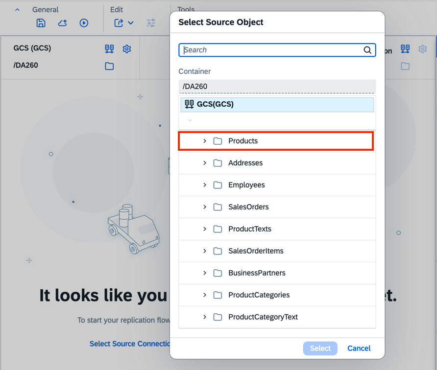
    
9.	After selecting ‘Products’, a new window will be open, you need to select the file named ‘Products.csv’ . Click on *Next* button to see the updated popup window.

    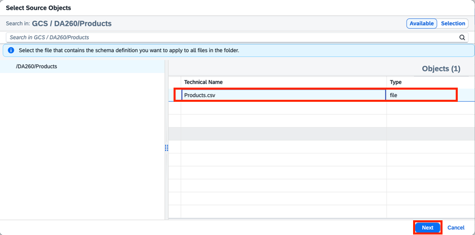

10.	Click on *Add Selection *that starts the fetching of source objects details from the source.

    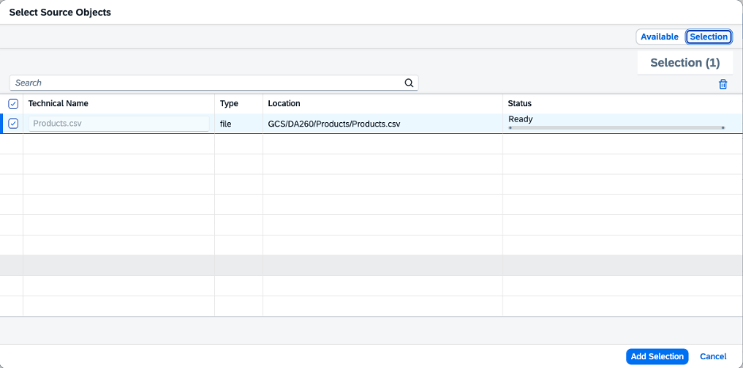

    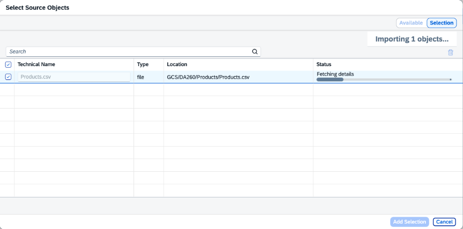

    You need to repeat steps 9-10 for all the files that are required for this exercise.

11.	The nine selected CSV Files are now added to the Replication Flow:

    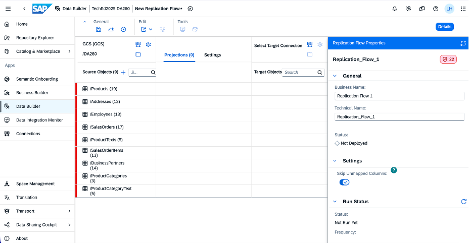

12.	We see some red notifications that are being shown on the left of each of the Source Objects, you need to *Select Configure Schema*, then *Apply Changes* and select the check box for the *Primary Key* of the source object and click the *Save* button.

    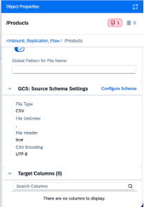
    

13.	You have the possibility to create projections for each of the csv files, but in this exercise no projections are required and hence you can skip the creation of projections. As a next step, click on the icon adjacent to *Select Target Connection*.

    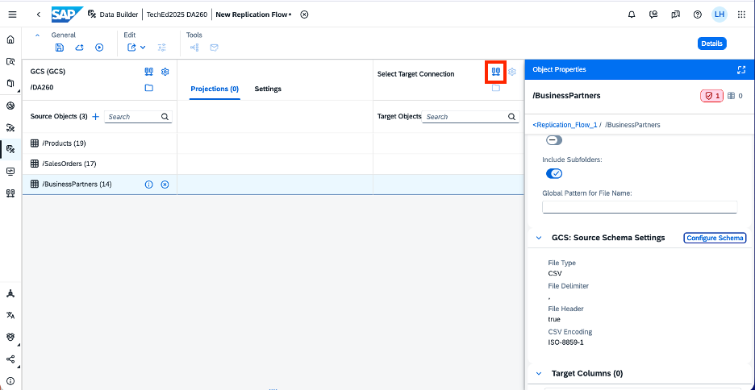

      The following popup window will appear where you need to select the target connection. In this case, please select *SAP Datasphere* as target connection.

    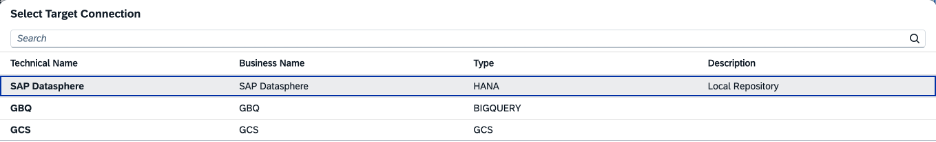

14.	The target connection details are now updated in your Replication Flows using SAP Datasphere as target and the target container is automatically updated with the space in which your user is logged in. In the highlighted section it shows the new target local tables that will be created in SAP Datasphere, which will be used as data sink for the data replication.

    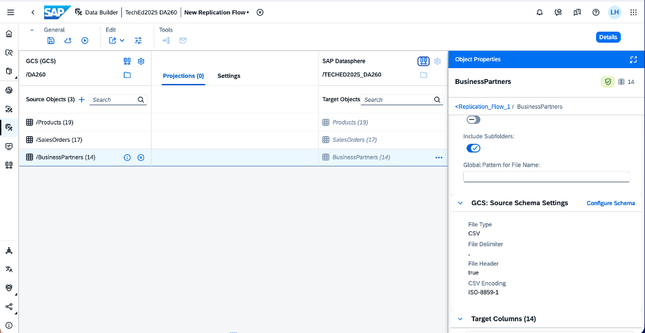

15.	For each of the target object, select the three-dot menu icon and select Rename Target Object:

    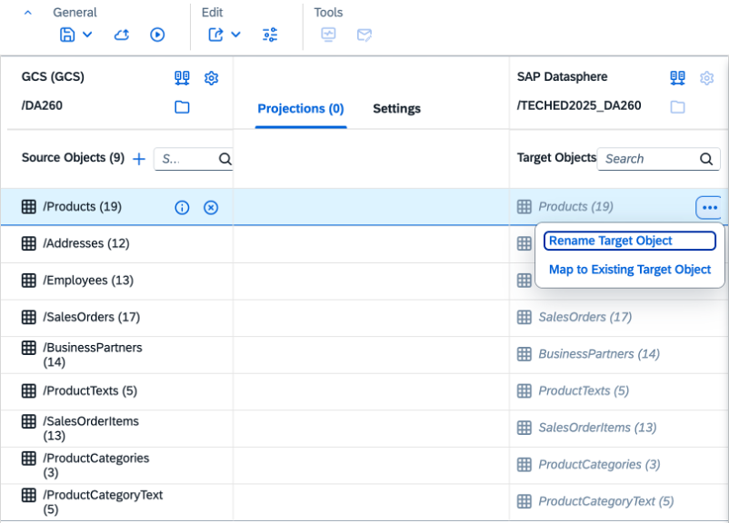

    Please rename Products to Products_LT, ..., ProductCategoryText to ProductCategoryText_LT. In this scenario we will let the replication flow create the target local tables instead of using pre-created tables.

    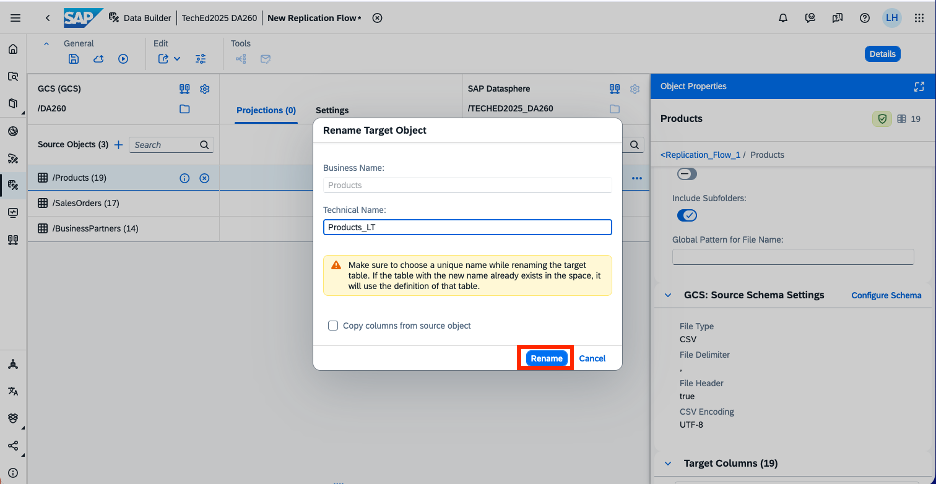

    **Note**: The replication flows can also write into already existing target tables in SAP Datasphere that have been created before. For this you can click on the three buttons next to the target table name and select Map to Existing Target Object. You can identify such tables that do not yet exist in your target system by looking at the name of the target data set, which are displayed slightly transparent and written in italic like it is currently displayed in your replication flow.

16.	Click on the Deploy Icon  in the general tab on top that launches Save popup window.:

      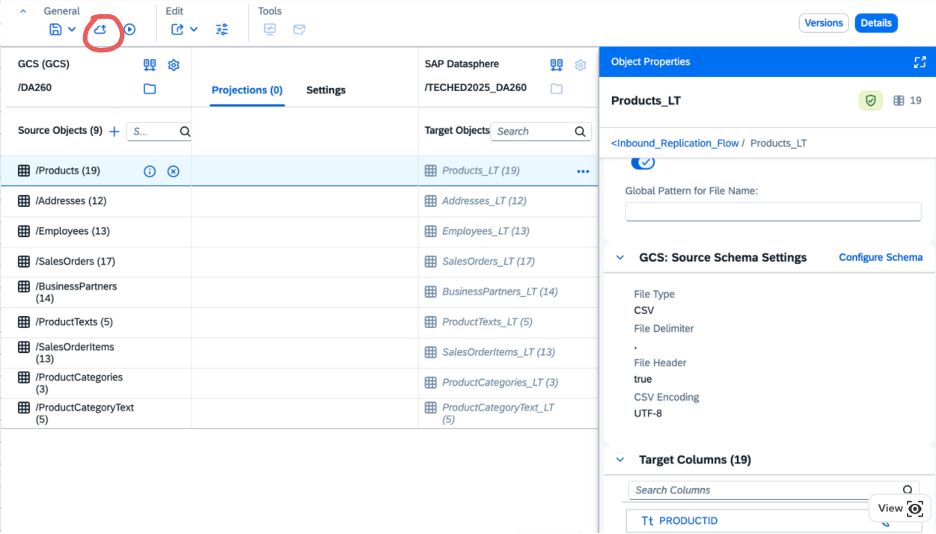    

      Change the default name being displayed by defining the business name as Inbound Replication Flow, which will automatically set technical name as Inbound_Replication_Flow.
   	
17.	After deployment, click on the Save  button, which will start the deploy process. Check for the status in Properties Panel. The status is shown as Not Deployed initially and will get updated to Deployed after few seconds.

   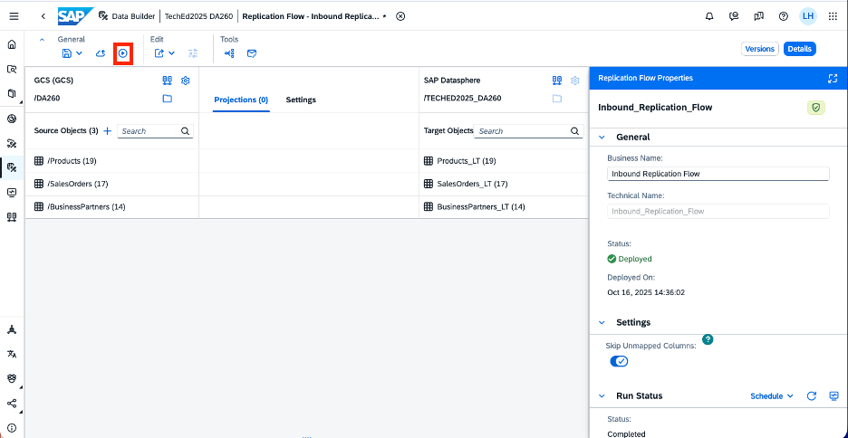

  **Note:** A message popup on the bottom of the screen will appear once the deployment process is finished and you can also check it using the notifications in the upper right corner of your browser
    
   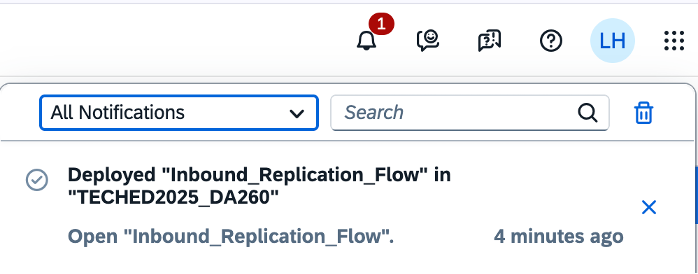

18.	Click on Monitor icon   in Run Status tab in property panel, which will directly navigate you to the detailed monitoring screen of your replication flow:

      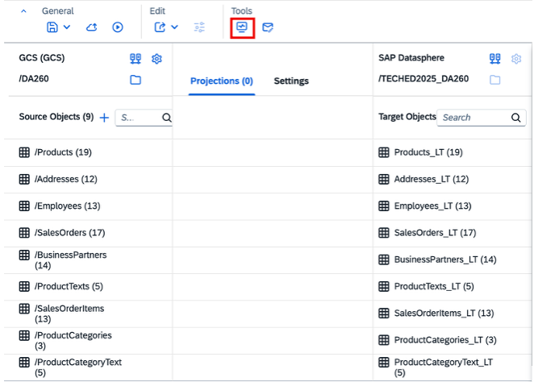

      Here you can see different information such as the source and target connection, load statistics and the status of the data replication for all CSV Files

   	 

19.	Finally, you can check the replicated data from Google Cloud Storage (GCS) CSV views in the Datasphere local tables. Therefore, go to the main page of the Data Builder and check for the tables you have defined in the Replication Flow before:

      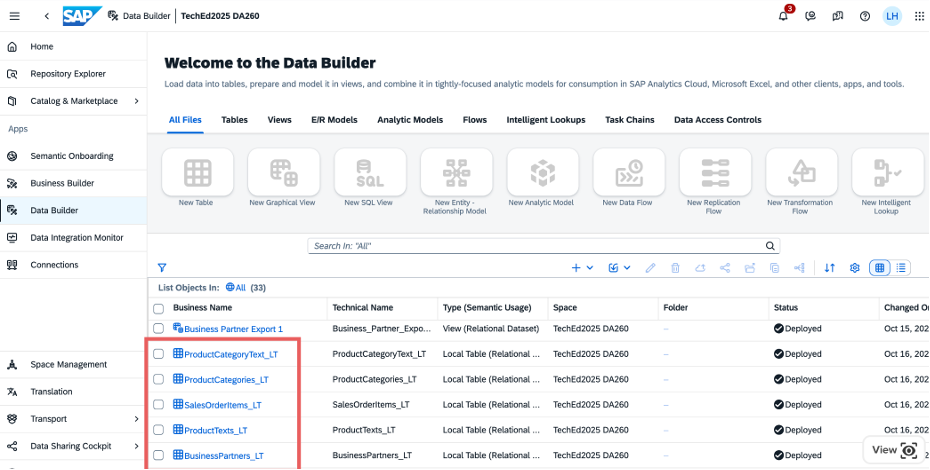
      
      Then select one of the local tables in SAP Datasphere, e.g. BusinessPartners_LT, by double-clicking on the table.
      
      Click on the *Preview* button as highlighted below:

      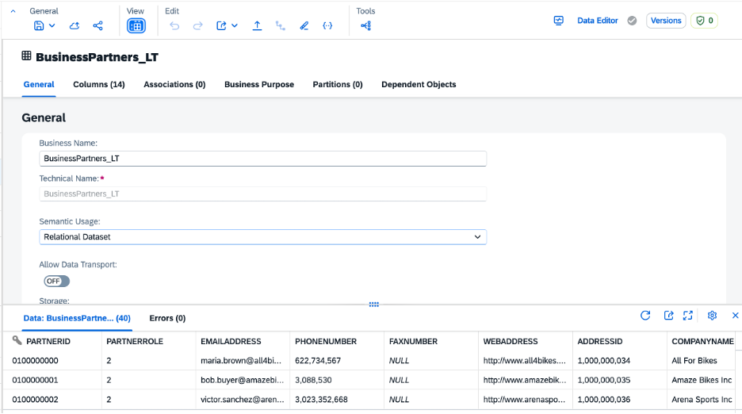

      You can now see the data that was replicated from Google Cloud Storage containing Business Partners information on the bottom of your screen
      

**This concludes the Exercise 1 where the objective is to replicate data from Google Cloud Storage into SAP Datasphere.**
      

Please click here to continue with [Exercise 4 - Federation in Datasphere with Remote Tables](../ex4/)

