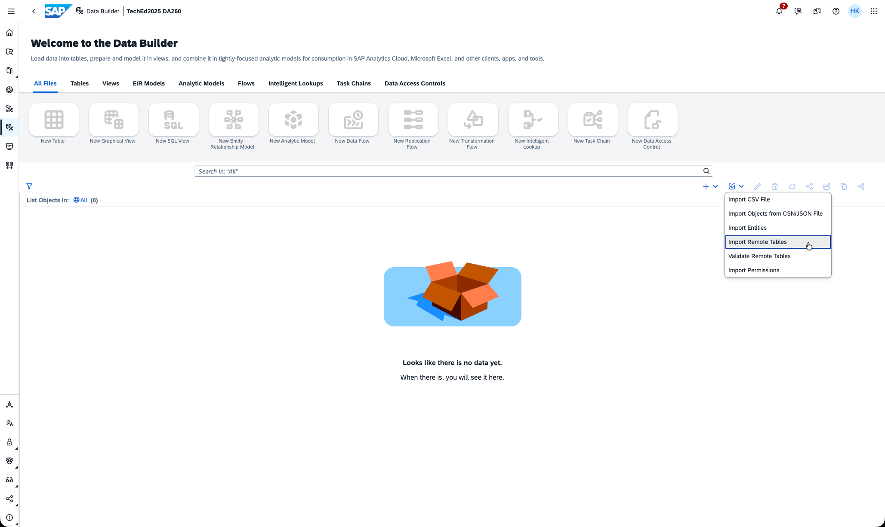
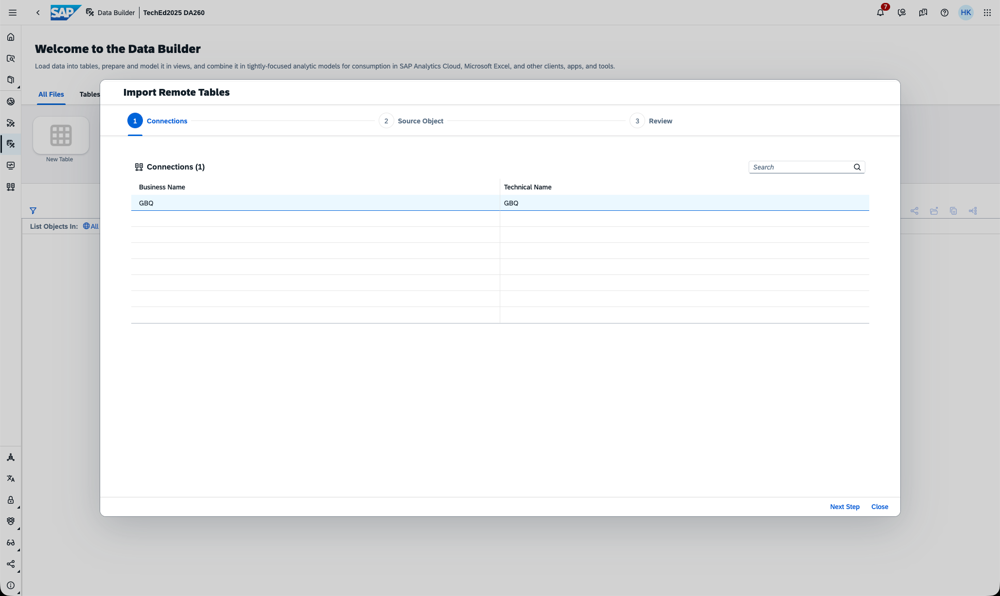
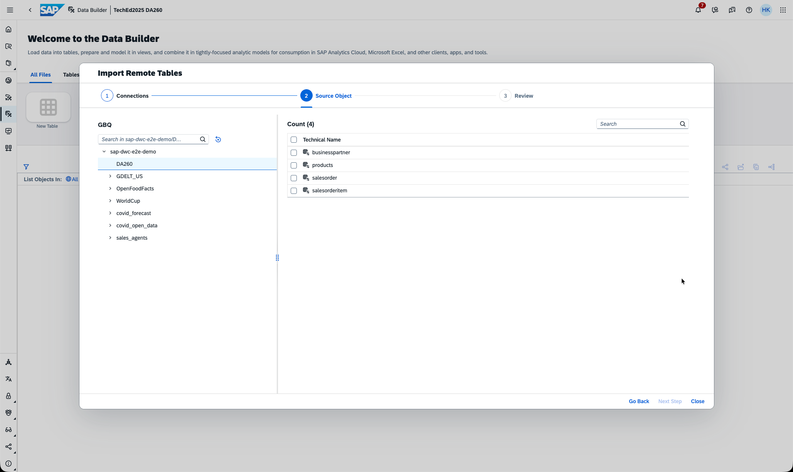
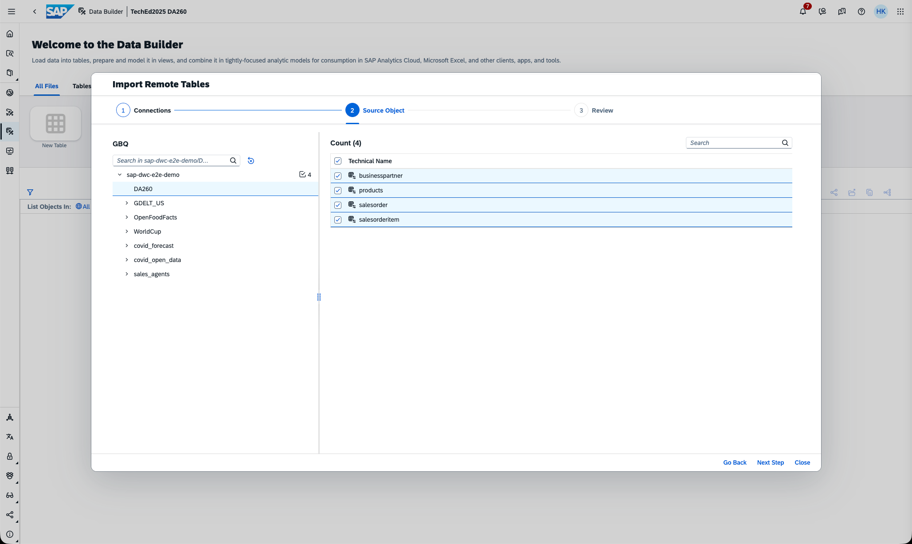
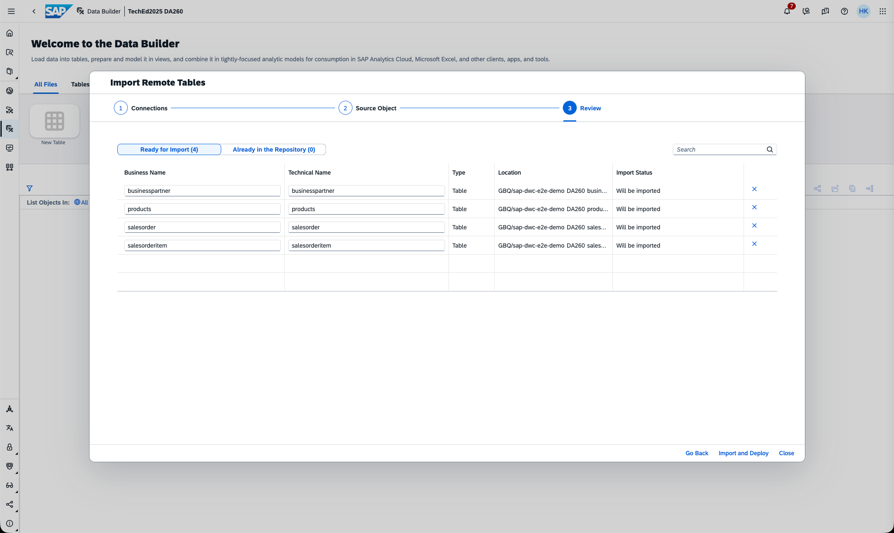
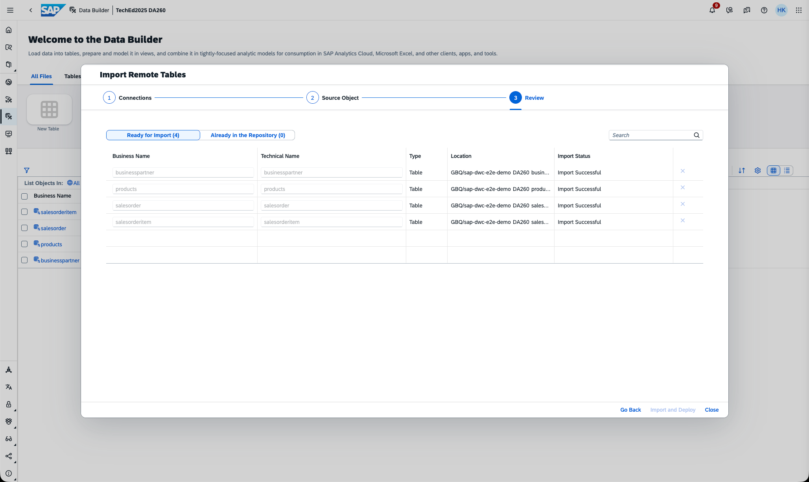
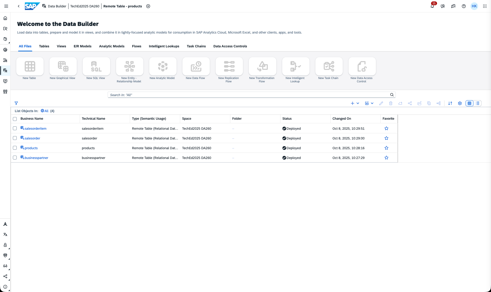
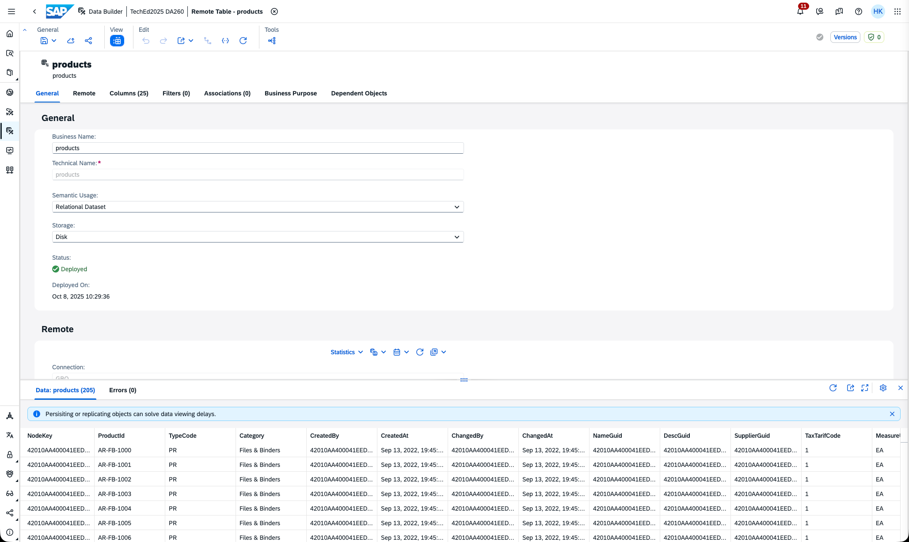

# Exercise 4 - Federation in Datasphere with Remote Tables

This exercise involves creating Remote Tables that establish a federated connection to tables from Google BigQuery (GBQ).

In this exercise, we will make use of connections that are pre-delivered in your SAP Datasphere instance, e.g., the GBQ cloud source system. You can check the GBQ connection in the **Connections** application inside your SAP Datasphere space.

The task is to create Remote Tables for:
- Business Partner – `businesspartner`
- Product – `products`
- Sales Order – `salesorder`
- Sales Order Items – `salesorderitem`

**Step-by-step guide:**

Refer to the provided solution below for a detailed, step-by-step guide to complete Exercise 4.

1. Open your SAP Datasphere using the provided credentials. Your user is associated with a default space that has the same name as your user, where you can work and create your various data artifacts.
   
   

2. Click on the **Data Builder** to see the Data Builder homepage as shown below, and find the import button. Select **Import Remote Table**.
   
   

3. A step-by-step import wizard opens. Select the GBQ connection and click **Next Step**.
   
   

4. In the next step of the wizard, select the source objects you want to create Remote Tables for. Open the tree on the left-hand side and navigate to the folder **DA260**.

   

5. Select the four tables either by clicking them one by one or by selecting the checkbox in the header, then click **Next Step**.

   

6. The wizard provides a review of what it is about to do. Since the tables have not been imported before, the **Import Status** is shown as **will be imported**. If an object already exists, its status will be shown here. In addition, you can rename the objects that will be created; note that the technical name cannot be changed later. Adjust the names if desired and click **Import and Deploy**.

   

7. This step may take a while. The system is now pulling the metadata from the source, creating the design-time for the remote tables, and deploying them to create the runtime objects. You will see toast notifications appearing. Once done, a summary is shown; click **Close**.

   

8. After the import, the Remote Tables have been successfully created in SAP Datasphere. To check if they are functioning, click on one of the tables to open the Remote Table editor.

   

9. In the Remote Table editor, open the preview window to test that the data can be read. In the **View** section, click the **Preview** button. This opens a preview in the lower section of the screen.

   

   The Remote Table Editor allows you to make changes to properties that are not technically bound to the source objects, such as Business Names, Semantic Usage, Filters (if supported), Associations, or Business Purpose information.  
   
   Properties that *are* technically bound to the source—such as technical names or data types of columns—cannot be changed in SAP Datasphere; they must be changed in the source, as the Remote Table is a mirror image. You can hide fields from the Remote Table in the column section; the fields will become non-queryable but can be re-added using the **+** symbol.

10. Navigate in the main menu to the **Data Integration Monitor** and select **Remote Queries**. This will show the statements sent to the remote system—in our case, the two statements used for the data preview: one for the record count and one to pull the preview data.

    

**This concludes Exercise 4, where the objective was to create Remote Tables in SAP Datasphere.**

Please continue with [Exercise 5](../ex5/).