# Exercise 5 - Push Data into Datasphere with OpenSQL

In this exercise, we will open an SQL endpoint that can be used by external tools to push data into SAP Datasphere.  
We will create credentials for those tools to authenticate, and we will also learn how to add the pushed entities to the repository.

### Step-by-step guide

Refer to the provided solution below for a detailed, step-by-step guide to complete Exercise 5.

1. Open your SAP Datasphere using the provided credentials. Your user is associated with a default space that has the same name as your user, where you can work and create your various data artifacts.
   
   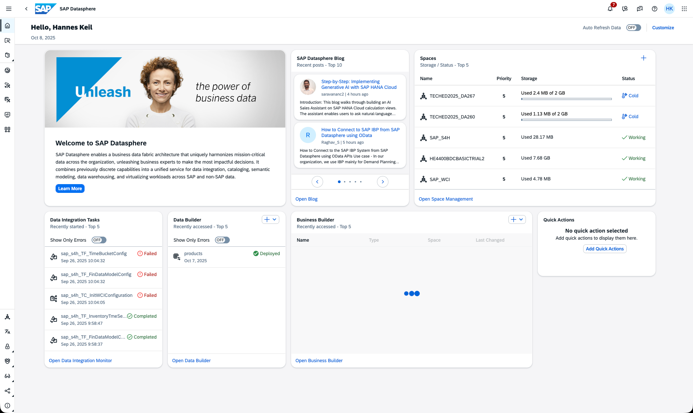

2. Navigate in the main menu to **Space Management** and open your space.
   
   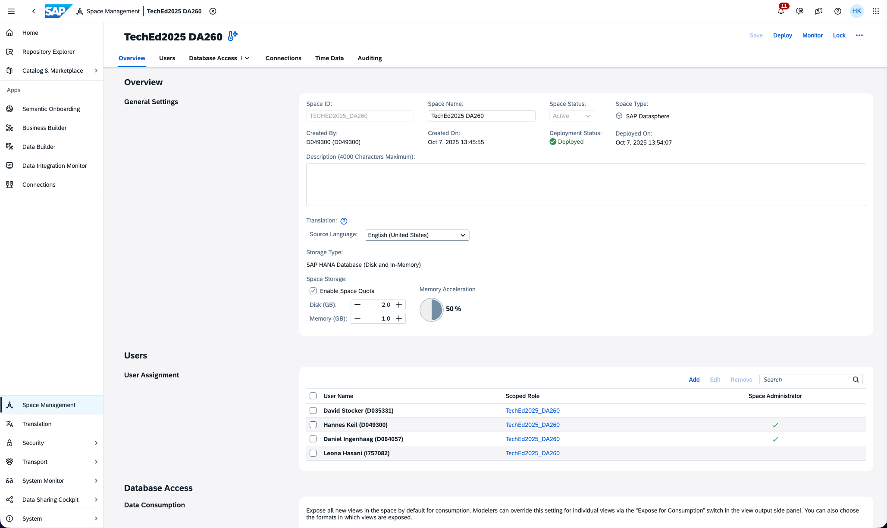

3. The **Database User** list in the *Database Access* section is used to open the endpoint and create the credentials to access the JDBC endpoint.  

   Click **Create** to create a new set of credentials.

   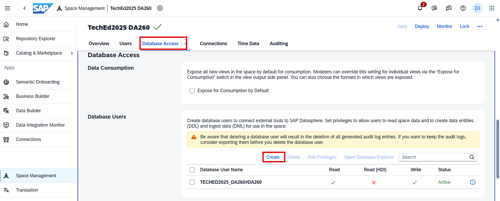

   Enter a database user suffix, enable read and write access, and click **Create**.
   
   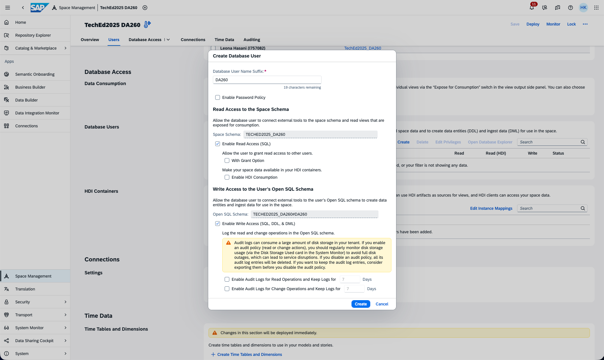

4. Click **Deploy** in the upper-right corner to activate the new user.  

   Wait until the status changes to **Active** before proceeding.

   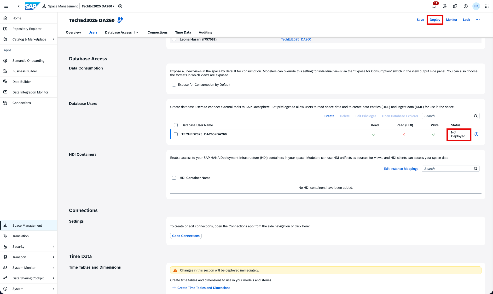

5. The user is now created in the database. Click on the **information symbol (i)** of the newly created user to access the connection details and credentials.
   
   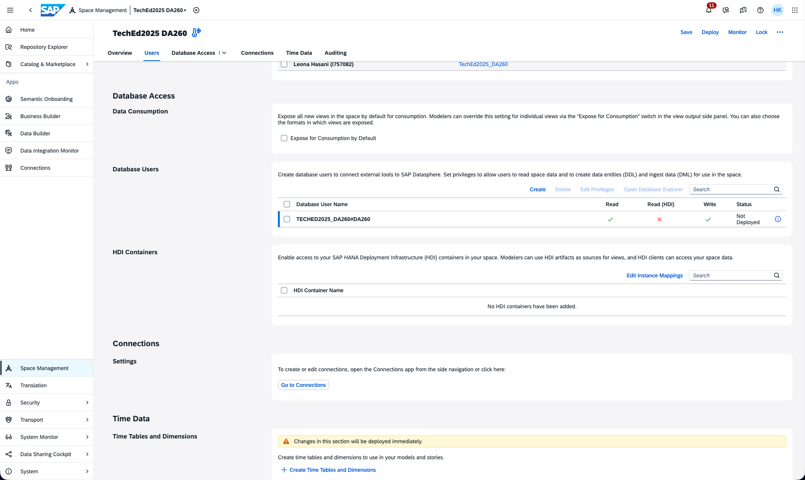

6. In the pop-up window, click **Request New Password**. This will show all the connection details required to establish a JDBC connection to SAP Datasphere.

   This is the only time the password can be copied. After closing the pop-up, you must request a new password if needed again — it cannot be retrieved.

   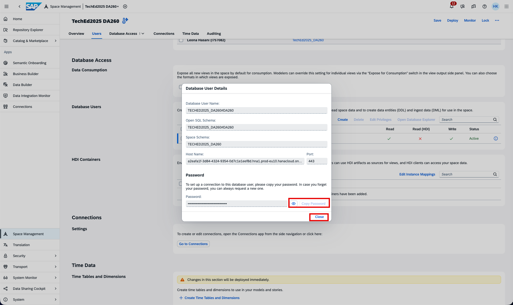

7. Select the user you just created by clicking the checkbox, then click **Open Database Explorer**.

   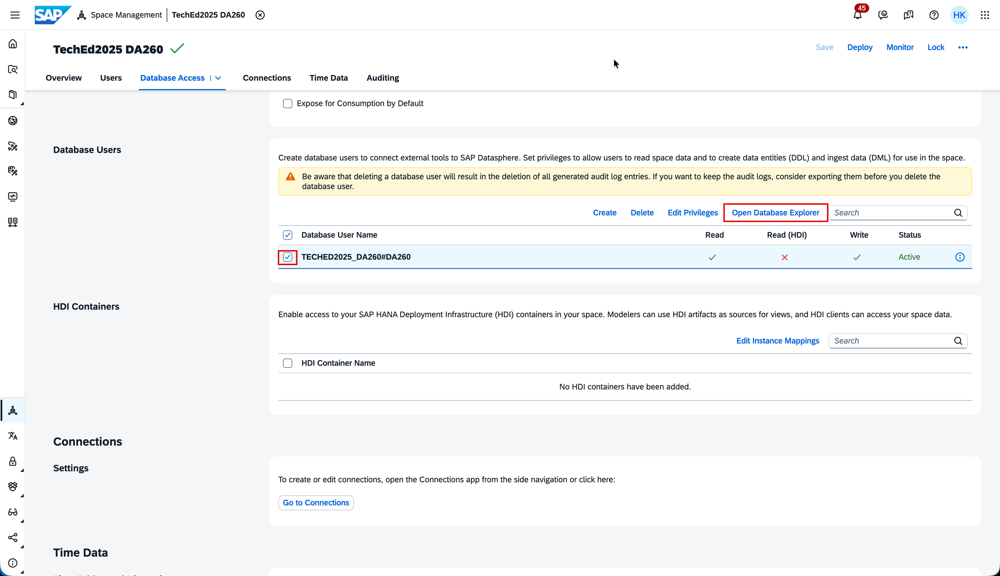

8. A new browser tab will open. Depending on the screen shown:

   - If this appears, enter `academy-platform` and click **Sign in with alternative identity provider**:

     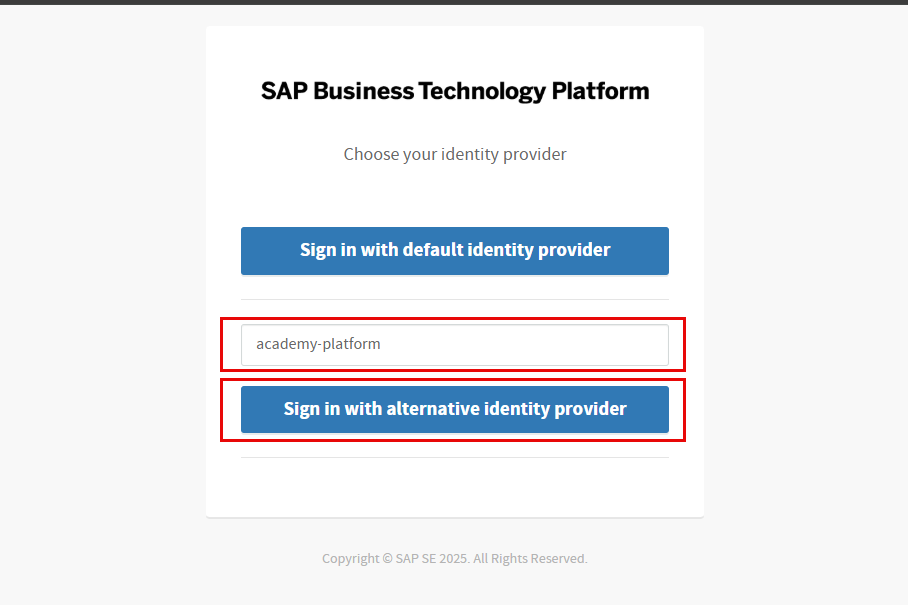

     Then click **Authorize**.

     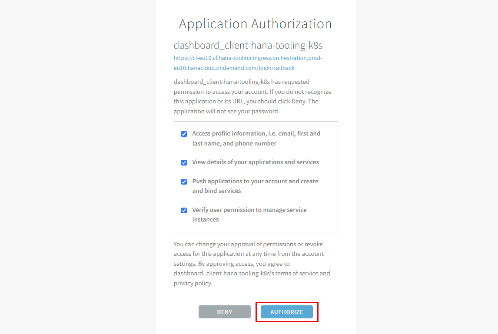

   - Otherwise, select the user with your assigned ID:

     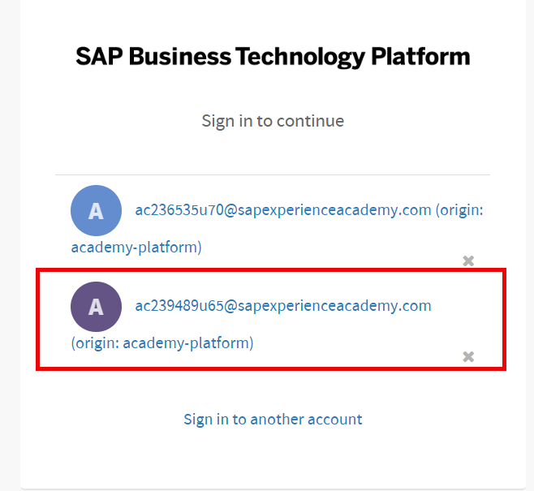

   The Database Explorer is integrated into the landscape, so connection details are pre-populated.  
   Now enter the previously generated password.  

   Optionally check **Save Password** and rename the display name to something readable.  
   Click **OK**.

   

9. Right-click the database connection to open the SQL console.

   

10. We will simulate an external tool pushing data (as an ETL tool would).  

    Create the table using the statement below (replace the schema name with your user’s schema).  
    After pasting, click **Run**.

    ```
    CREATE COLUMN TABLE "BusinessPartnersOpenSQL"(
        "PARTNERID" NVARCHAR(10) NOT NULL,
        "PARTNERROLE" NVARCHAR(3),
        "EMAILADDRESS" NVARCHAR(255),
        "PHONENUMBER" NVARCHAR(30),
        "FAXNUMBER" NVARCHAR(30),
        "WEBADDRESS" NVARCHAR(1024),
        "ADDRESSID" NVARCHAR(10),
        "COMPANYNAME" NVARCHAR(80),
        "LEGALFORM" NVARCHAR(10),
        "CREATEDBY" NVARCHAR(10),
        "CREATEDAT" DATE,
        "CHANGEDBY" NVARCHAR(10),
        "CHANGEDAT" DATE,
        "CURRENCY" NVARCHAR(5),
        "Change_Type" NVARCHAR(1) DEFAULT 'I' NOT NULL,
        "Change_Date" LONGDATE DEFAULT CURRENT_UTCTIMESTAMP NOT NULL,
        PRIMARY KEY("PARTNERID")
    ) PAGE LOADABLE
    UNLOAD PRIORITY 5 AUTO MERGE;

    INSERT INTO "BusinessPartnersOpenSQL" VALUES(
        '100001',
        '1',
        'bdc@sap.com',
        '0800/5 34 34 24',
        '0800/5 34 34 24',
        'www.sap.com',
        '12398789',
        'SAP SE',
        'SE',
        'SAP',
        '20251004',
        'SAP',
        '20251004',
        'EUR',
        '',
        ''
    );
    ```

    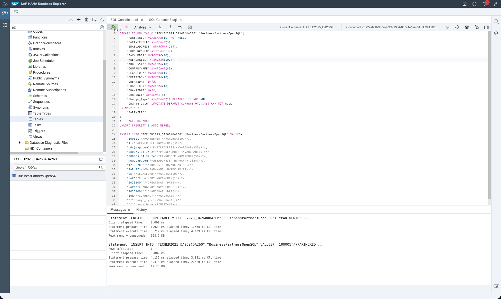

    Upon success, you will see messages at the bottom.

11. Navigate back to the **Data Builder** in SAP Datasphere.  

    The table you created is not automatically visible, but it *is* usable.

    Create a new **Graphical View**.  

    Switch the **Repository Browser** to **Source** (left side).  

    You will see the OpenSQL schema named after the user created in step 3.  

    Drag the table into the canvas — this triggers creation of the Repository Object.

    

12. Once deployed, you can start previewing and consuming the table.

    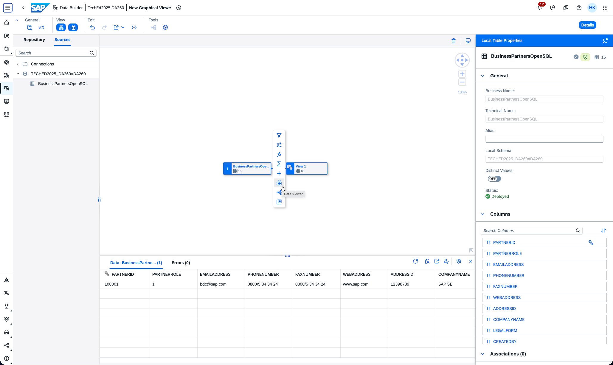

**You have created an endpoint, created a table, and inserted a record. The table is now available in SAP Datasphere. This simulates an external tool creating a table and writing data into Datasphere. 
This concludes Exercise 5.**

---

### Additional Information

The database is protected by a firewall. Any external tool must come from a whitelisted IP.  
In the trial system, users do *not* have privileges to modify the IP allowlist.

To modify it (in your own landscapes):

**System → Configuration → IP Allowlist → Trusted IP**

This shows all trusted IPs.


Click **Add** to add entries (single IPs or networks).


Please continue with [Exercise 6](../ex6/).