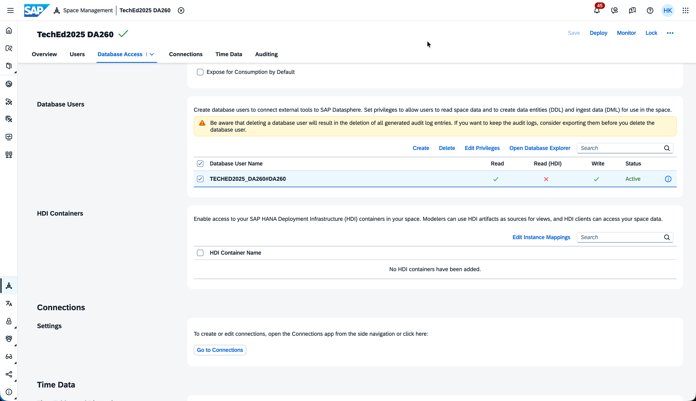

<<<<<<< HEAD
# Exercise 5 - Push data into Datasphere with OpenSQL

In this exercise we are going to open an SQL end point that can used by external tools to push data into SAP Datasphere.  
We will create credentials for the external tools to authenticate on SAP Datasphere. We will also learn how to add the pushed entities to the repository. 

### Prerequisite
You need an SAP Account for this exercise to login to the Database Explorer, in case you don't have one, you can create one with you E-Mail address via [SAP Account](https://www.sap.com/account.html)

Click on "Create your account today" and follow the process. You need to confirm the email address in the mail send to your email account on your personal device. 
 


### Step-by Step-guide:
Refer to the provided solution below for a detailed, step-by-step guide to complete Exercise 5.

1.	Open your SAP Datasphere using the provided credentials. Your user is associated with a default space that has the same name as your user where you can work and create your various data artifacts.
   
    

2.	Navigate in the main menu to *"Space Management"* and open your space. 
   
    

3.	The Database User list in the section Database Access is used to open the endpoint and create the credentials to access the JDBC endpoint. CLick on *"Create"* to create a new set of credentials. Enter a Database user suffix and enable read and write access and click *"Create"*
   
        

4.	The user is now created in the database, to get to the connection details and the credentials click on the information symbol (i) of the newly created user. 
   
        

5.	The user is now created in the database, to get to the connection details and the credentials click on the information symbol (i) of the newly created user. Click in the pop-up window *"Request New Password"*. This will show you all the connection details required to establish a JDBC connection to SAP Datasphere. This is the only time the password that can be copied into the clipboard or be shown, after closing the pop-up you need to request a new password, as the old one can no longer be retrieved, make sure to copy it and close the pop-up. 
   
        


6.  By selecting the user, we just created and clicking *"Open Database Explorer"* we use the JDBC connection. 
        

7.  Use your SAP Account to login, if you don't have one go up the prerequisite of this exercise. Then the Database explorer is acting as the external tool. The DB Explorer is as SAP tool integrated into our landscape, so that the connection details get pre-populated for you, for other tools they need to manually transferred to create the connection. Enter the previously generated password, if you check the *"Save Password"* box the DB Explorer will store the password for future use. It can be helpful to change the display name to something more human readable, from the GUID that is hat by default. Click *"OK"* to create the connection. 

    

8. By right clicking the database connection we can open the SQL console and create a new table, with the statement
    

9. We are simulating an external tool with the Database explorer, that is creating a table and pushing data into it (like an ETL tool would). We can create a new table, with the statement below, replace the schema name with your database user name that you created earlier. The statement will also enter a row for later usage (make sure to replace both schema placeholder).  After pasting the statement click *"Run"*
    ```
    CREATE COLUMN TABLE "<schema>"."BusinessPartnersOpenSQL"(
        "PARTNERID" NVARCHAR(10) NOT NULL,
        "PARTNERROLE" NVARCHAR(3),
        "EMAILADDRESS" NVARCHAR(255),
        "PHONENUMBER" NVARCHAR(30),
        "FAXNUMBER" NVARCHAR(30),
        "WEBADDRESS" NVARCHAR(1024),
        "ADDRESSID" NVARCHAR(10),
        "COMPANYNAME" NVARCHAR(80),
        "LEGALFORM" NVARCHAR(10),
        "CREATEDBY" NVARCHAR(10),
        "CREATEDAT" DATE,
        "CHANGEDBY" NVARCHAR(10),
        "CHANGEDAT" DATE,
        "CURRENCY" NVARCHAR(5),
        "Change_Type" NVARCHAR(1) DEFAULT 'I' NOT NULL,
        "Change_Date" LONGDATE DEFAULT CURRENT_UTCTIMESTAMP NOT NULL,
    PRIMARY KEY(
	    "PARTNERID"
    )
    )   PAGE LOADABLE
    UNLOAD PRIORITY 5 AUTO MERGE;

    INSERT INTO "<schema>"."BusinessPartnersOpenSQL" VALUES(
        '100001'/*PARTNERID <NVARCHAR(10)>*/,
        '1'/*PARTNERROLE <NVARCHAR(3)>*/,
        'bdc@sap.com'/*EMAILADDRESS <NVARCHAR(255)>*/,
        '0800/5 34 34 24'/*PHONENUMBER <NVARCHAR(30)>*/,
        '0800/5 34 34 24'/*FAXNUMBER <NVARCHAR(30)>*/,
        'www.sap.com'/*WEBADDRESS <NVARCHAR(1024)>*/,
        '12398789'/*ADDRESSID <NVARCHAR(10)>*/,
        'SAP SE'/*COMPANYNAME <NVARCHAR(80)>*/,
        'SE'/*LEGALFORM <NVARCHAR(10)>*/,
        'SAP'/*CREATEDBY <NVARCHAR(10)>*/,
        '20251004'/*CREATEDAT <DATE>*/,
        'SAP'/*CHANGEDBY <NVARCHAR(10)>*/,
        '20251004'/*CHANGEDAT <DATE>*/,
        'EUR'/*CURRENCY <NVARCHAR(5)>*/,
        ''/*Change_Type <NVARCHAR(1)>*/,
        ''/*Change_Date <TIMESTAMP>*/
    )
    ```
    
    Upon successful execution you will see the success messages on the bottom. 

11. Navigating back to the Data Builder in SAP Datasphere, the just created table is not automatically visible, but can be used. Create a new graphical view. Switch the *"Repository Browser to Source"*, on the left side of the canvas. There you will see the OpenSQL schema, it carries the name of the User we created in step 3. Under stat schema the created table should be visible and can be dragged into the canvas. This will trigger the creation of the Repository Object for the OpenSQL table. 
    


12. Once the table is deployed we can start previewing and consuming the table. 

    


**We have created an endpoint, created a table and filled with a record, that table is available in SAP Datasphere. This simulates an external tool, that creates a table and writes data into Datasphere. This concludes the Exercise 5 where the objective is to create Remote Tables in in SAP Datasphere.**

### Additional Information

The database is protected by a firewall. Any external tool trying to access the database needs to come from a whitelisted IP. In our trial system the user do not have sufficient privileges to modify the IP Whitelist. To modify the IP WHitelist, we need to navigate to System -> Configuration -> IP Allowlist -> Trusted IP. This will show you the list of all trusted IP's
   
    

By clicking the *"Add"* button you can add entries to the whitelist. Here you can add single IP's or networks of IP's

    

Please click here to continue with [Exercise 6](../ex6/)
=======
# Exercise 8 - Outbound pull of data in Datasphere with JDBC or oData

In this exercise we will build on the OpenSQL created in [Exercise 5](../ex5/). 
The idea is to allow to pull data through the same OpenSQL endpoint and in addition provide an oData endpoint. 


**Step-by-step guide:**

Refer to the provided solution below for a detailed, step-by-step guide to complete Exercise 8.

1.	In order to provide data from SAP Datasphere space into an OpenSQL schema, we need to create a view that is flagged for consumption. This will grant the OpenSQL user we created in [Exercise 5](../ex5/) the right to read from the view. Go to the *Data Builder* of your space and create a graphical view based on a table that created before. Click on *"New Graphical View"*, drag for example the businesspartner table (1) from the repository into the canvas (2), give the View a Name (e.g. Business Partner Export)(3), turn on the Expose for consumption (4) and save and deploy (5). 
   
    

2.	Once deployed, we can explore the oData endpoint. Click in the tools section on *"Generate oData Request" (1)*, select what you want to read (2) Data, Metadata or Service information. Click *"Preview" *(3)
   
    
     
     You can also generate an OpenAPI request and get the URL to the oData Service. To use the oData you need a configured OAuth client. [Help: Consume Data via the OData API](https://help.sap.com/docs/SAP_DATASPHERE/43509d67b8b84e66a30851e832f66911/7a453609c8694b029493e7d87e0de60a.html?q=oData) 

3.	This should return you a preview of the oData response, as example here the data from businesspartner.
   
    


4.  To test the JDBC/SQL endpoint, lets go back to the database explorer from [Exercise 5](../ex5/) Step 8. Open the *"View"* section in the Catalog of the Database.(1) Make sure you have selected not only the OpenSQL schema but also the Space Schema, which carries the same name as the technical name of the space.(2) Select the *View* you created in Step 1 (3) and right click to select *"Open Data"* (4). This will open you a data preview of the view (5)
    


**We have created an JDBC/SQL, and an oData endpoint to read data from SAP Datasphere**


Please click here to continue with [Replicate Local Tables from SAP Datasphere to Google Big Query (GBQ) with Replication Flows](../ex9/)
>>>>>>> 2892f3d6ea33739eb9295ba3fe8ebfe601e3f3a7
