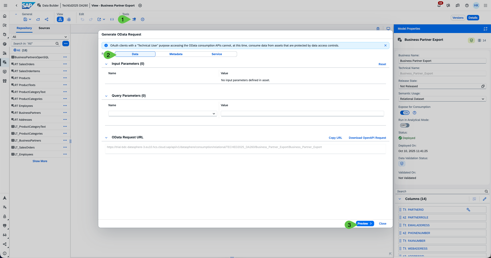
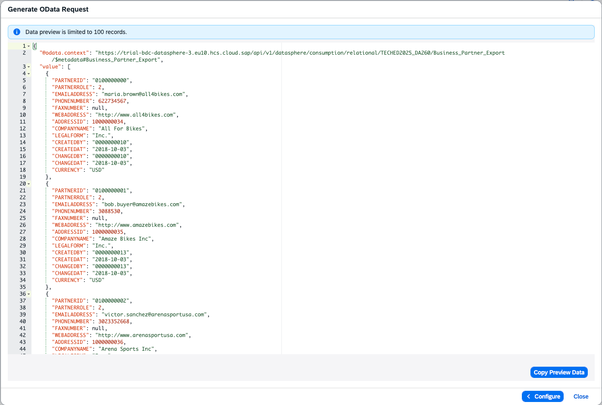

# Exercise 6 - Outbound pull of data in Datasphere with JDBC or OData

In this exercise you will build on the OpenSQL created in [Exercise 5](../ex5/).  
The idea is to allow pulling data through the same OpenSQL endpoint and additionally provide an OData endpoint. 

**Step-by-step guide:**

Refer to the provided solution below for a detailed, step-by-step guide to complete Exercise 6.

1. In order to provide data from SAP Datasphere space into an OpenSQL schema, we need to create a view that is flagged for consumption. This grants the OpenSQL user created in [Exercise 5](../ex5/) the right to read from the view.  

   Go to the **Data Builder** of your space and create a graphical view based on a table created before.  

   Click **New Graphical View**, **drag** for example the `businesspartner` table (1) from the repository into the canvas (2), **give the View a Name** (e.g., "Business Partner Export") (3), **turn on Expose for consumption** (4) and **save and deploy** (5).

   

2. Once deployed, we can explore the OData endpoint.  

   Click the tools section on **Generate OData Request** (1), select what you want to read (2) — Data, Metadata, or Service information — and click **Preview** (3).

   

   You can also generate an OpenAPI request and get the URL of the OData Service.  

   To use the OData endpoint you need a configured OAuth client.  
   **Help:** [Consume Data via the OData API](https://help.sap.com/docs/SAP_DATASPHERE/43509d67b8b84e66a30851e832f66911/7a453609c8694b029493e7d87e0de60a.html?q=oData)

3. This should return a preview of the OData response, e.g., the data from BusinessPartner.

   

4. To test the JDBC/SQL endpoint, return to the **Database Explorer** from [Exercise 5](../ex5/), Step 8.  

   Open the **View** section in the database catalog (1).  

   Make sure both schemas are selected:  
   - the OpenSQL schema  
   - the Space Schema (same technical name as your space) (2)  

   Select the view you created in Step 1 (3) and right-click to choose **Open Data** (4).  

   This opens the data preview (5).

   **Important Note:** Please make sure you select the space schema in the left menu bar. Per default, only the created OpenSQL schema is selected.

   

**You have created a JDBC/SQL and an OData endpoint to read data from SAP Datasphere.**

Please click here to continue with [Replicate Local Tables from SAP Datasphere to Google BigQuery (GBQ) with Replication Flows](../ex7/)
