# Exercise 9 - Replicate Local Tables from SAP Datasphere to Google Big Query (GBQ) with Replication Flows

This exercise involves creating a Replication Flow that reads data from SAP Datasphere local tables and replicates this data into Google BigQuery (GBQ). This process involves modelling of a replication flow and configuring it to consume a pre-existing GBQ connection and pick the required source objects to replicate them into new target tables in Google BigQuery.

The Task is to load the SAP Datasphere local table for:
- BusinessPartnersOpenSQL

Step by Step guide:
Refer to the provided solution below for a detailed, step-by-step guide to complete Exercise 9.

1.	Open your SAP Datasphere using the provided credentials. Your user is associated with a default space that has the same name as your user where you can work and create your various data artifacts like the replication flow.
   
    

2.	Click on the **Data Builder** to see the Data Builder homepage as shown below and you can see *New Replication Flow* tile.
   
    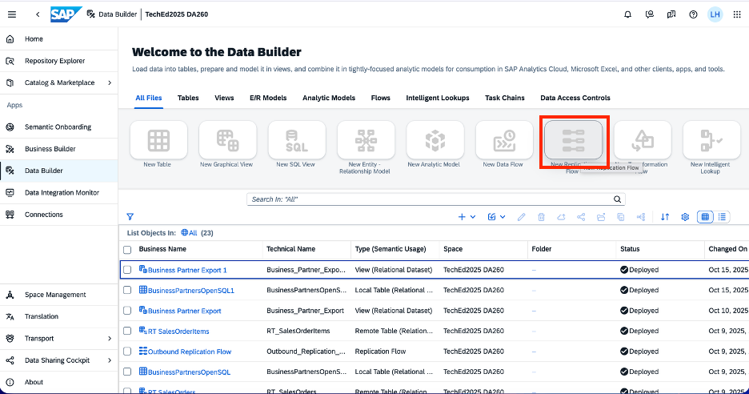

3.	Click on **New Replication Flow** tile to launch the creation of new a replication flow.
   
    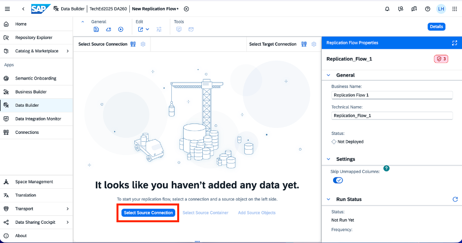

4.	Click on **Select Source Connection** button that launches a popup window to select the source connection.

    

    Select **SAP Datasphere** as source connection, which is technically using connection type HANA from the list of the available connections. It will update the connection and after it you need to select Add Source Objects button which is auto selected for the next step on the bottom of the screen highlighted in blue. Please select **‘Add Source Object’**.

    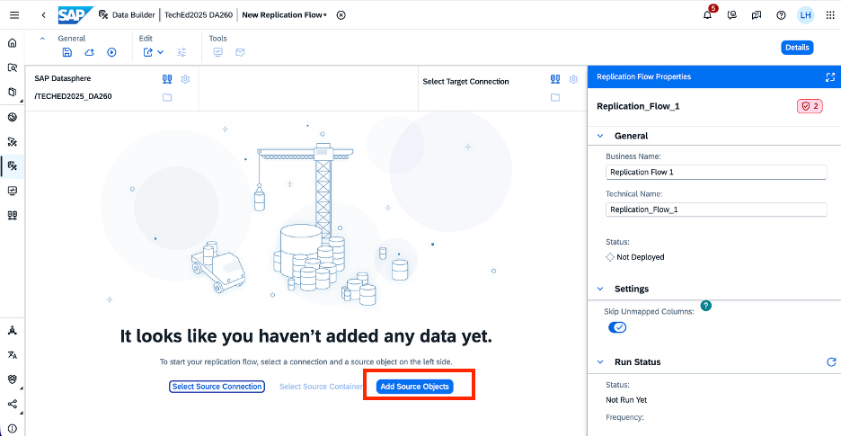

5. After selecting **‘Add Source Object’** button, a new popup window will open, which shows all the repository objects that are available. For this exercise, please select **BusinessPartnersOpenSQL**, and click **OK** button.

    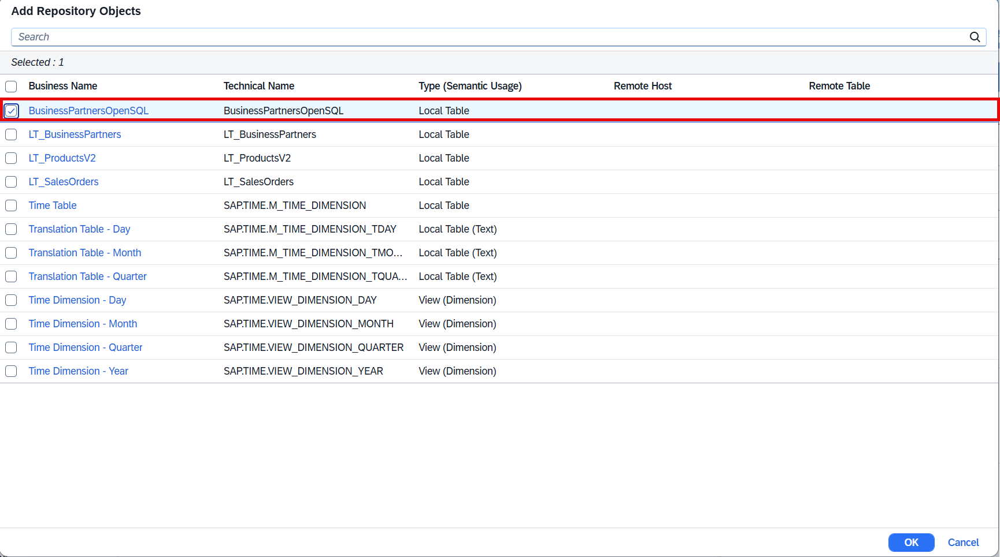

**Note:** You can add additional objects into the Replication Flow, but in this exercise we will only replicate one local table from SAP Datasphere to illustrate the general approach.
Additionally, in this particular case only "Initial Load" is supported when replicating data from the OpenSQL schema. Using delta capaiblities would require to use local tables with delta capture enabled. Also, a lot of other data sources do support native delta capabilities that can be used in a replication such as ABAP-based sources (SAP S74HANA, SPA BW, SAP ECC etc.), databases (e.g. Microsoft SQL, SAP HANA etc.) any additional data sources.

6. You have the possibility to create projections for each of the listed objects, but in this exercise no projections are required and hence you can skip the creation of projections. As a next step, click on the icon adjacent to **Select Target Connection**.

    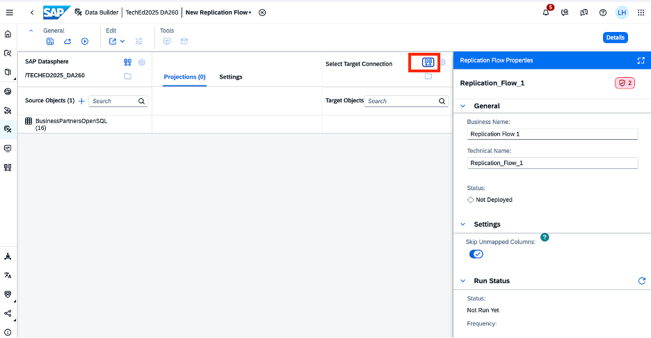

    The following popup window will appear where you need to select the target connection. In this case, please select Google Big Query as target connection.

    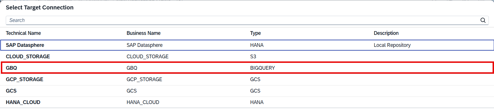

7. The target connection details are now updated in your Replication Flows using **GBQ** as target, and after this you need to select the icon **Select Container**, where it leads to a new popup window, and from there you need to select container **‘DA260_TARGET’**. After selecting, please click button *Select*. You need to choose **BussinessPartnersOpenSQL** as the file that you want to replicate from SAP Datasphere to GBQ.

    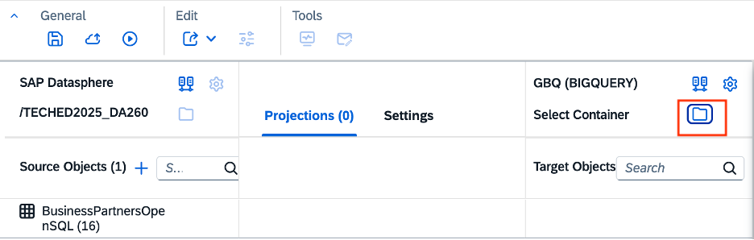

    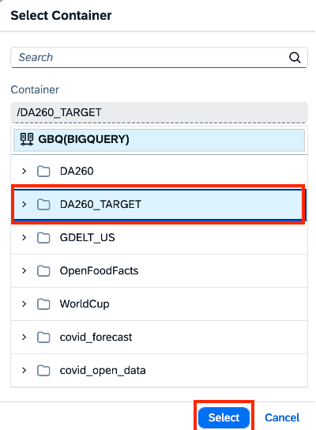

    

8.	After this you can click om the three-dot icon to rename the target object. It will open a new popup window, you rename to **UserX_businessPartnersOpenSQL**, where **'X'** represents your user id and click the **‘Rename’** button. 
Example. if you are using user id '10', please use the following name for your target in GBQ: User*10*_businessPartnersOpenSQL
 

    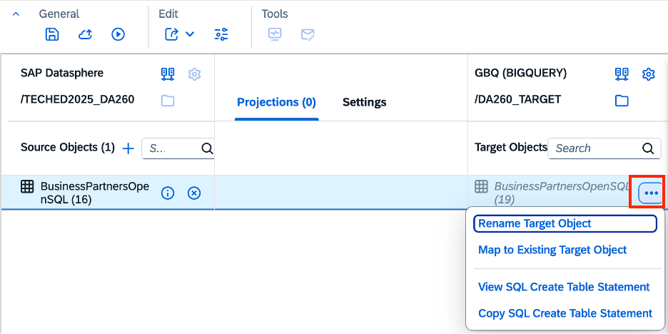

    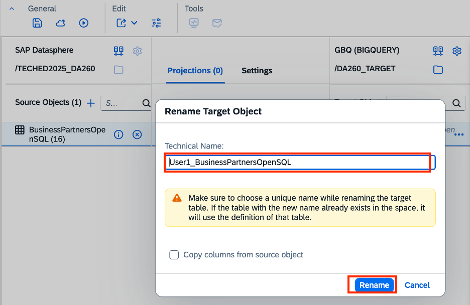

    Below, you can see the renamed target object.

    
    
9. Click on the **Deploy Icon** in the general tab on top that launches *Save* popup window. 

    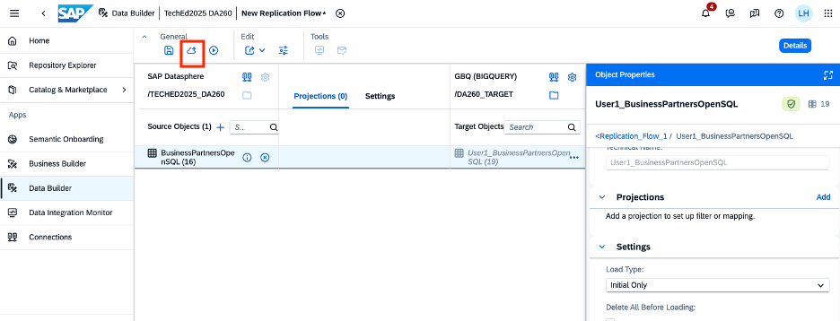

    Change the default name being displayed by defining the business name as Outbound Replication Flow 1, which will automatically set technical name as Outbound_Replication_Flow1, and then click the **Save** button.

    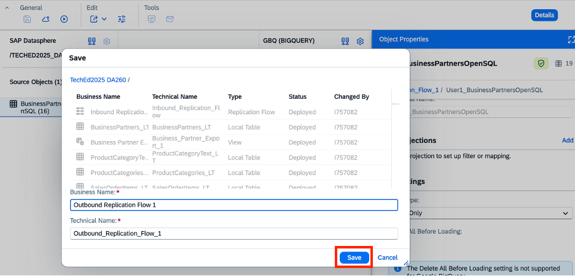

    

10.	Once the status is Deployed, click on the **Run Icon**  in the General Tab above. You will see the Run Status in property panel getting updated to ‘Running’.

    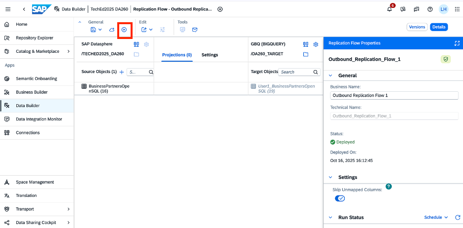

11.	Click on **Monitor Icon**  in Run Status in property panel, or in the right side of Replication Flow Properties, which will directly navigate you to the detailed monitoring screen of your replication flow: 

    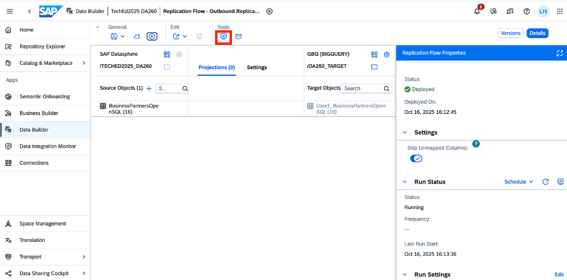

    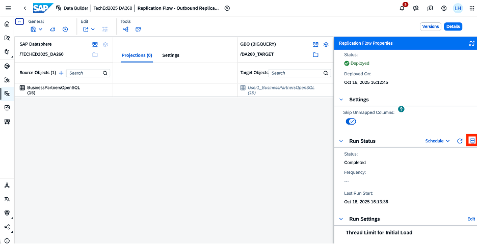

    After clicking on the Monitor icon, a new window will be open and you can see all the monitoring details, as below:

    

    You can decide to start/pause/rename/stop the Run. Or, in case the replication flow has still not been completed, please click in the **Refresh** button as shown with the arrow in the image below

    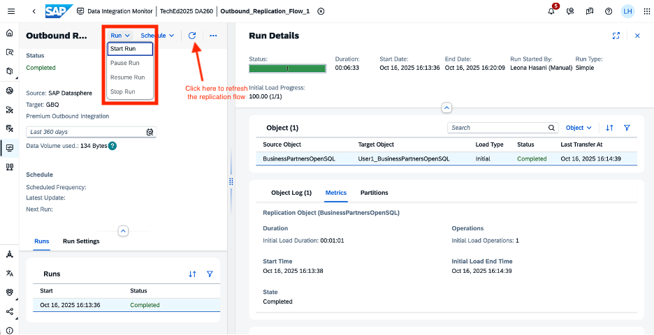

    Here you can see statistics, and the status of the data replication for all our target source object.

**This concludes the Exercise 9 where the objective is to replicate data from SAP Datasphere into Google Big Query (GBQ)**
**Congratulations, you have now completed all exercises of DA260 Hands-On Session. Thank you for your participation and we hope you enjoyed our exercises** 

