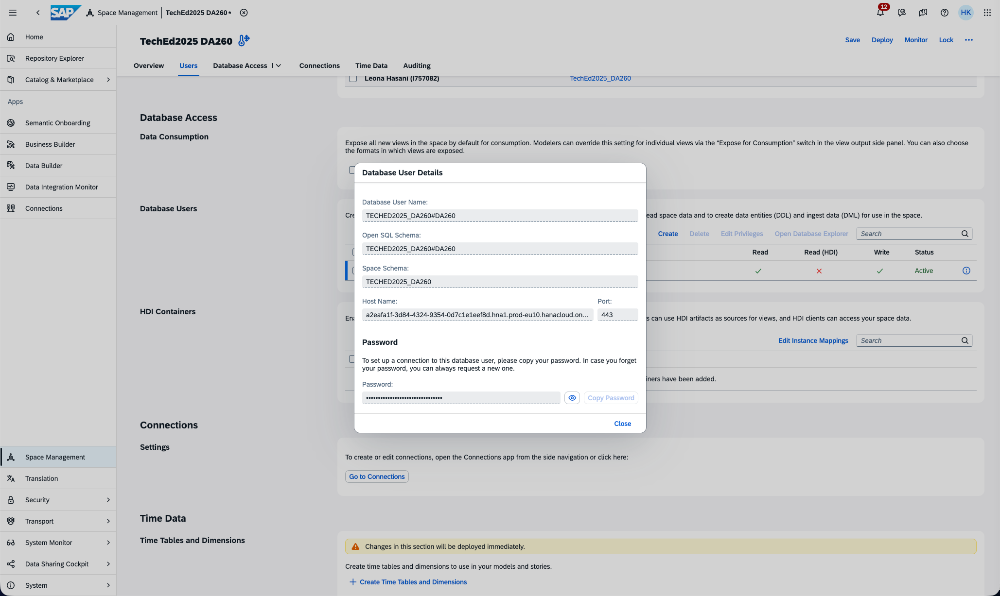
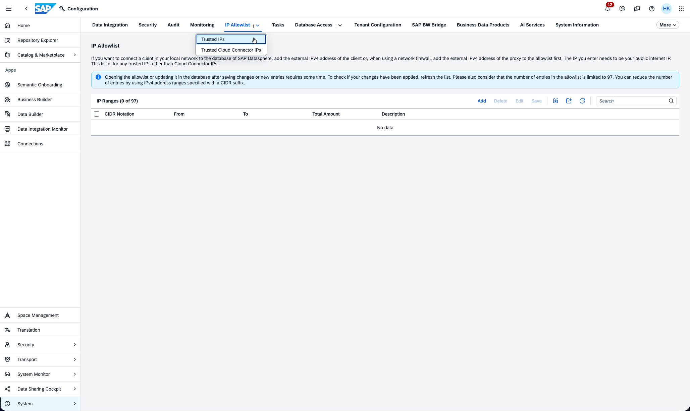
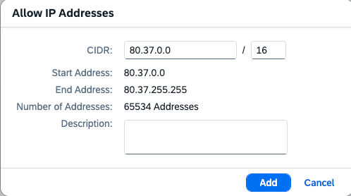
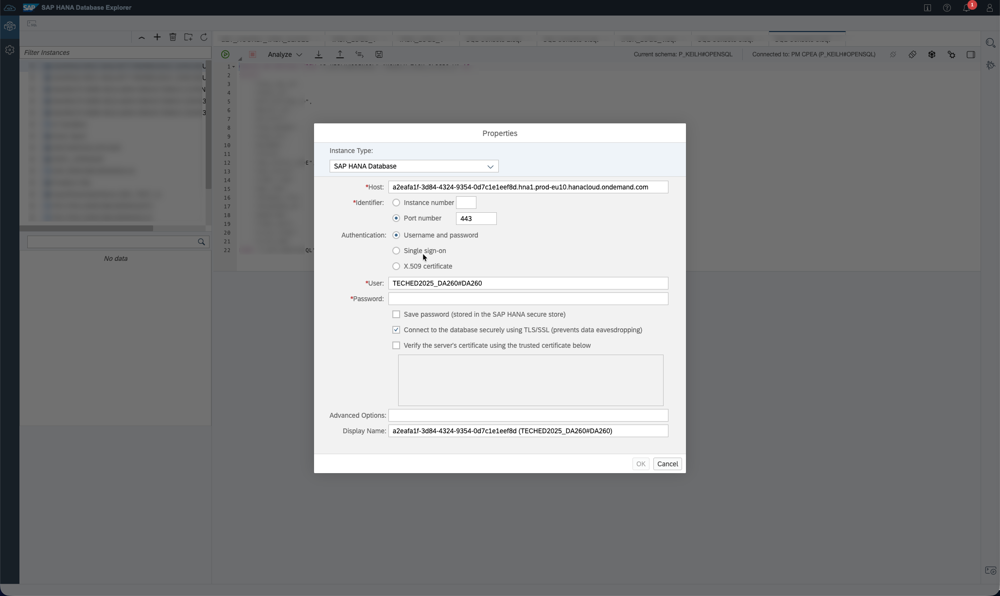
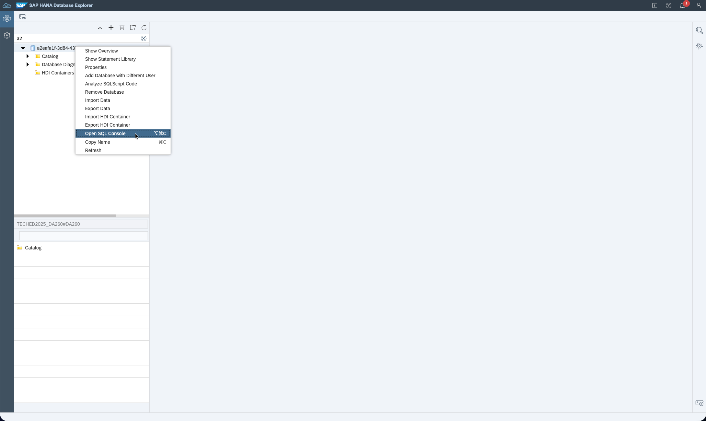
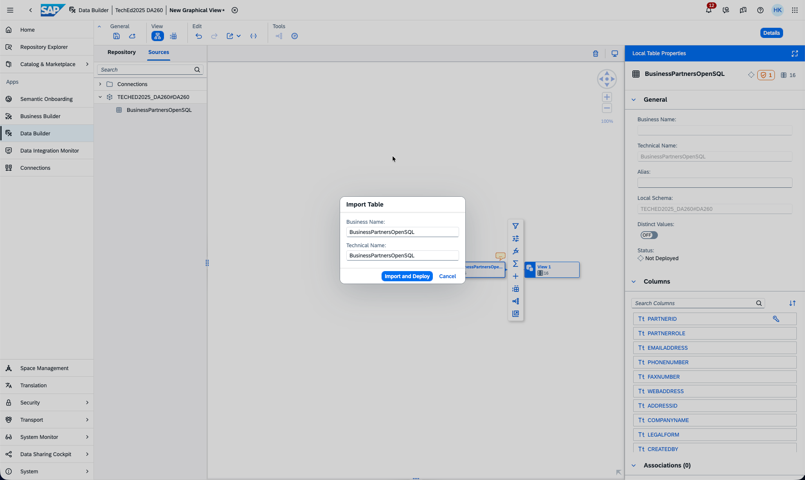

# Exercise 8 - Outbound pull of data in Datasphere with JDBC or oData

In this exercise we will build on the OpenSQL created in [Exercise 5](../ex5/). 
The idea is to allow to pull data through the same OpenSQL endpoint and in addition provide an oData endpoint. 

Step by Step guide:
Refer to the provided solution below for a detailed, step-by-step guide to complete Exercise 1.

1.	In order to provide data from SAP Datasphere space into an OpenSQL schema, we need to create a view that is flagged for consumption. This will grant the OpenSQL user we created in [Exercise 5](../ex5/) the right to read from the view. Do to the Data Builder of your space and create a graphical view based on a table that replicated before. Click on "New Graphical View", drag the businesspartner table (1) from the repository into the canvas (2), give the View a Name (e.g. Business Partner Export)(3), turn on the Expose for consumption (4) and save and deploy (5). 
   
    

2.	Navigate in the main menu to Space Management and open your space. 
   
    

3.	The Database User list in the section Database Access is used to open the endpoint and create the credentials to access the JDBC endpoint. CLick on "Create" to create a new set of credentials. Enter a Database user suffix and enable read and write access and click "Create"
   
        

4.	The user is now created in the database, to get to the connection details and the credentials click on the information symbol (i) of the newly created user. 
   
        

5.	The user is now created in the database, to get to the connection details and the credentials click on the information symbol (i) of the newly created user. Click in the pop-up window "Request New Password". This will show you alle connection details required to establish a JDBC connection to SAP Datasphere. This is the only time the password that can be copied into the clipboard or be shown, after closing the pop-up you need to request a new password, as the old one can no longer be retrieved, make sure to copy it and close the pop-up 
   
        

6.	(Read Only) THe database is protected by a firewall. Any external tool trying to access the database needs to come from a whitelisted IP. In our trial system the user do not have sufficient privileges to modify the IP Whitelist. To modify the IP WHitelist, we need to navigate to System -> Configuration -> IP Allowlist -> Trusted IP. This will show you the list of all trusted IP's
   
        

7. (Read Only) By clicking the "Add" button you can add entries to the whitelist. Here you can add single IP's or networks of IP's

        

8. Going back to the Space Management, by selecting the user, we just created and clicking "Open Database Explorer" we use the JDBC connection. Here the Database explorer is acting as the external tool. The DB Explorer is as SAP tool integrated into our landscape, so that he connection details get pre-populated for you, for other tools they need to manually transferred to create the connection. Enter the previously generated password, if you check the "Save Password" box the DB Explorer will store the password for future use. It can be helpful to change the display name to something more human readable, from the GUID that is hat by default. Click "OK" to create the connection. 

    

9. By right clicking the database connection we can open the SQL console and create a new table, with the statement
    

11. Navigating back to the Data Builder in SAP Datasphere, the just created table is not automatically visible, but can be used. Create a new graphical view. Switch the Repository Browser to Source, on the left side of the canvas. There you will see the OpenSQL schema, it carries the name of the User we created in step 3. Under stat schema the created table should be visible and can be dragged into the canvas. This will trigger the creation of the Repository Object for the OpenSQL table. 
    

12. Once the table is deployed we can start previewing and consuming the table. 

    

**We have created an endpoint, created a table and filled with a record, that table is available in SAP Datasphere. This simulates an external tool, that creates a table and writes data into Datasphere. This concludes the Exercise 5 where the objective is to create Remote Tables in in SAP Datasphere.**

Please click here to continue with [Exercise 6](../ex6/)
