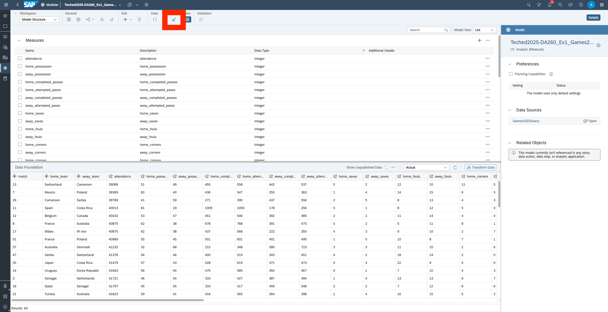
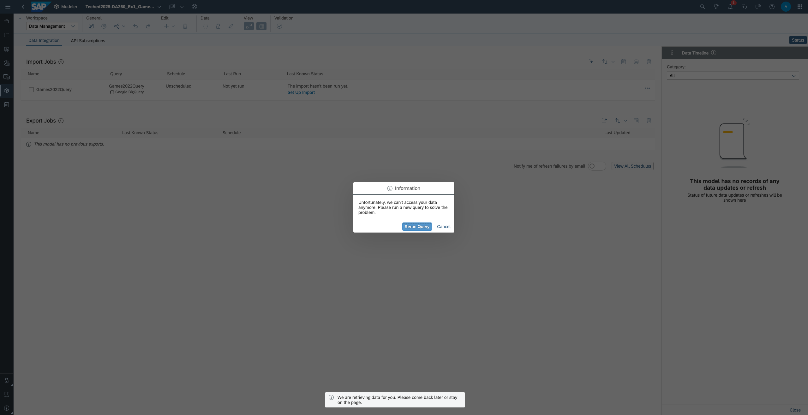
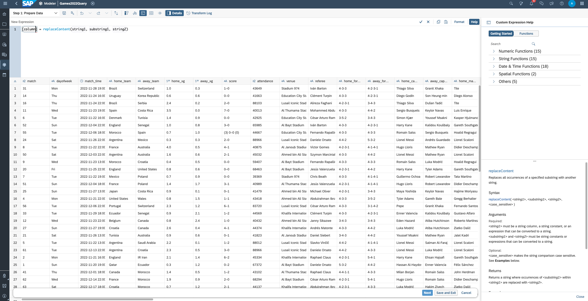
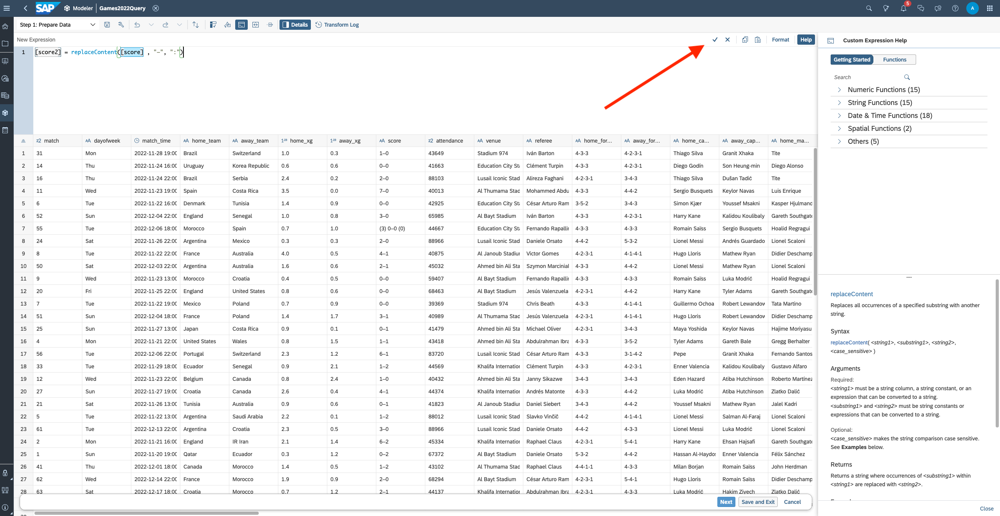
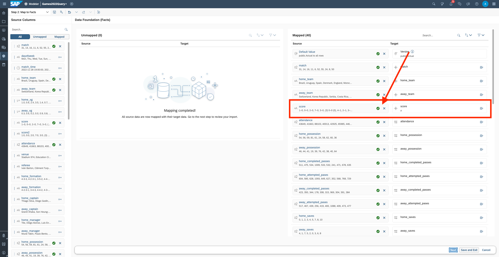
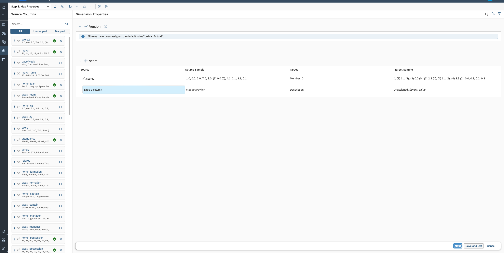
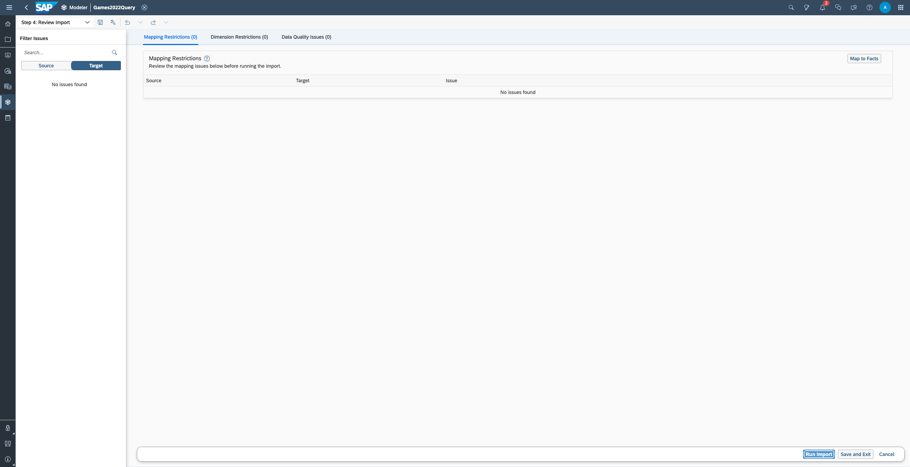

# Exercise 8 - Loading Data into an existing SAC model

In exercises 1 and 2, you created a model from data.  In this exercise, you will load new data into **Teched2025-DA260_Ex1_Games2022**n which you created in exercise 1.  This is SAC's ```Extract, Transform, Load (ETL)``` workflow, where you connect, bring the data into SAC and then transform it to fit to the semantic model that it will be used with.  You will spend more time in the modeling tools than in the previous exercises, because SAC's data connectivity and semantic modeling are intimately intertwined.

**Step 0** to **Step 28** were carried out in Continue to - [Exercise 1 - Create an Analytics Cloud Model with Acquired Data](../ex1/README.md), and this exercise carries on from **Step 29** onwards.


## Step 29

Return to the modeling app and re-open **Teched2025-DA260_Ex1_Games2022**.

Note that the **score** column uses a dash between the home and away scores.  We'd like this to be a semicolon, so we'll reload this data and fix this with a wrangling transform.

Click the eraser icon, in the Data group, to delete records from the fact table.





## Step 30

Next will come the fact filter dialog.  Here, you can set the filter for fact deletion; all records where the specified dimension value(s) are checked. This gives you the option to delete specific records matching the specified filter pattern. By default, all dimension members of the first dimension in the list are checked and this will delete all fact from the table.

Click **OK**.


## Step 31

Click **OK** to confirm that you want to clear the fact table.


## Step 32

You will now see an empty fact table in your model.


## Step 33

Navigate to the **Data Management** workspace.


## Step 34

Recall that when we originally connected to the data to start creating the model, we created an initial import job.  When you create a model from data, you skip past data wrangling and column mapping, which is why the import job "has not been set up".  We will now set this import job up.  

Click on **Set Up Import**.


## Step 35

Here you see a significant difference in behavior, from what you'll encounter with Datasphere Replication Flows in [Exercise 3](../ex3/README.md).  
- With Replication Flows, remote data is replicated into Datasphere tables, and you can then do what you want with those tables later.
- SAC import jobs always exist in the context of a data model. The remote data is replicated into local tables, but this is regarded as draft data, yet to be prepared for the model.  This draft data is used when preparing wrangling (data preparation) and mapping, but is not visible outside this context and is not retained for very long.

If you very recently created your model, you draft data may still be present, and you won't see this popup.  If you were to come back a few days later, the draft data would have been cleaned up. If the draft data is still present, you'll simply go to the next step. Otherwise, this popup will prompt you to re-run the query before proceeding.  You will nearly always be prompted to rerun your query.

If you are prompted, click **Rerun Query***.




## Step 36

Take a moment to orient yourself in the **Data Wrangler**.  Here is where you can transform data.
- It uses a spreadsheet visual paradigm, allowing the user to work interactively on the data that they are transforming and see the effects of their transforms in real-time.
- Sometimes data needs to be transposed from columnar to row format.  E.g. a set of revenue figures might be split across columns, for side by side comparison of year-on-year, but you'll want these figures in a single measure later.  You can transpose data right from the menu bar, using **Unpivot**.
- You have access to two separate "formula bars"; the interactive **Create Transform** builder, and a powerful **Custom Expression Editor**.  "Formula bars" is in quotes, because the interactive **Create Transform** builder is not actually a formula editor, but uses a visual expression as an assistance mechanism.
- You can toggle the display of your transform log on, to see what transforms you have previously done in this session, revert and edit transforms. 
- Lastly, note that the Wrangler did detect that the text cells that actually held numeric data were in fact numbers and assigned the data type appropriately.  


## Step 37

Click the **Custom Expression Editor** icon, to open the editor.


## Step 38

We're going to want to use the replaceContect() expression.  You can use the **Custom Expression Editor**'s code completion assistant, by starting to type in the command.  Type in "re".

```re```

Select **replaceContect** from the dropdown.


## Step 39

The custom expression formula will initially look like this:

```[column] = replaceContent(string1, substring1, string2)```

- **Column** - is the name of the new columns that will be created.
- **string1** - is the columns where the change will be.
- **substring1** - is the string pattern that will be swapped out.
- **string2** - is the string pattern that will be swapped in.




## Step 40

Create a new column, called **score2**, which duplicates **score** and replaces "–" with ":".

```[score2] = replaceContent([score] , "–", ":")```

**Note!**  The **"–"** coming from the database is a long dash and not the ascii **"-"**.  It is bext to copy and paste it from the table, or from this document.

Click the checkmark, to execute the formula.




## Step 41

You can now compare **score** and **score2*** and see the difference in the text.

Click **Next** to proceed to mapping.


## Step 42

Now please on your top left, choose **Step 2: Map to FActs**.

In **Mapping**, look in the mapping section, or the right side.  See where the **score** column in the draft data is mapped to the **score** dimension.   

Click the **X**, next to the **score** column in the draft data, to delete this mapping.




## Step 43

The **score** dimension now has no mapping.

Drag **score2** from the **Source Columns** to the box labeled "Drag a column".


## Step 44

See where the **score2** column in the draft data is mapped to the **score** dimension. 

Click **Next** to proceed to Validation.


## Step 45

Click **Next**.

The draft data will not be validated against the model.  Any problems will be reported here, allowing you to fix them before commiting them to the fact table.




## Step 46

No problems should be reported. The most common cause of issues would be unbooked dimension members, where a column being mapped to a dimension deos not a value not in the dimension table.

Since our model only uses so-called "single column" dimensions, where we did not attach a column to a dimension (e.g. a public dimension), there are no foreign key constraints. If your fact data does not align with your master data, this is the place where you'd normally discover that.

**Note!**  We deliberated used only single column dimensions as this is a data connectivity exercise and not a modeling one; and this exercise is long enough as it is.  


## Step 47

If no problems are reported, you can click **Run Import**. 





## Step 48

Click **Finish** to start the data load. 


## Step 49

While the data load is running, you will see a running animation, under **Last Known Status**.


## Step 50

Once the data load is finished, you should see a chain of green checkmarks, under **Last Known Status**.  This indicates the status of the various steps of the process, connection, query, wrangling, validation.  If there is a problem, or if a process is incomplete (such as if you had clicked on **Save and Exit**), you will see it here.

You can set up automatic, scheduled data refreshes.  To do so:

- Click the checkbox next to all of th eload jobs of a model that you want to maintain a particular schedule for.
- Then click the Calendar icon.


## Step 51

You can set up automatic, scheduled data refreshes.  To do so:

- Click the checkbox next to all of th eload jobs of a model that you want to maintain a particular schedule for.
- Then click the Calendar icon.


## Step 52

Maintain your desired schedule settings, e.g. once a week at 6AM, etc.  You can schedule load jobs more frequently than on a one-hour basis.


## Step 53

Return to the ***Model Structure** workspace. 


## Step 54

Look in your data foundation.  You'll see that the members of the **score** dimension now display the transformed version. 


## Summary

You've now created a new model in SAC by importing data.  

Analytics Cloud Model with Live Data

Continue to - [Exercise 2 - Analytics Cloud Model with Live Data](../ex2/README.md)