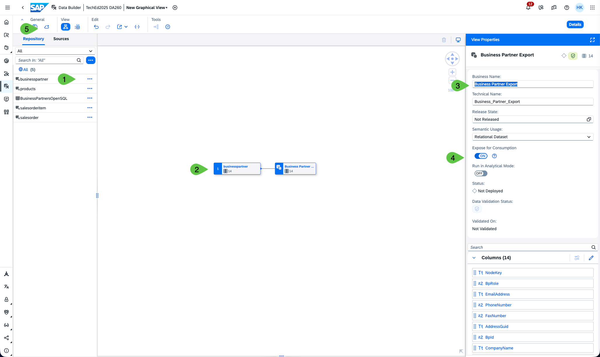
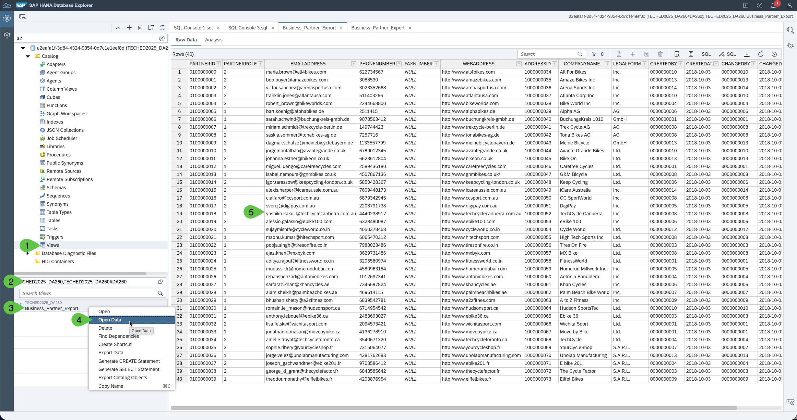

# Exercise 8 - Outbound pull of data in Datasphere with JDBC or oData

In this exercise we will build on the OpenSQL created in [Exercise 5](../ex5/). 
The idea is to allow to pull data through the same OpenSQL endpoint and in addition provide an oData endpoint. 

**Step-by-step guide:**

Refer to the provided solution below for a detailed, step-by-step guide to complete Exercise 8.

1.	In order to provide data from SAP Datasphere space into an OpenSQL schema, we need to create a view that is flagged for consumption. This will grant the OpenSQL user we created in [Exercise 5](../ex5/) the right to read from the view. Go to the Data Builder of your space and create a graphical view based on a table that created before. Click on "New Graphical View", drag for example the businesspartner table (1) from the repository into the canvas (2), give the View a Name (e.g. Business Partner Export)(3), turn on the Expose for consumption (4) and save and deploy (5). 
   
    

2.	Once deployed, we can explore the oData endpoint. Click in the tools section on "Generate oData Request" (1), select what you want to read (2) Data, Metadata or Service information. Click "Preview" (3)
   
    
     
     You can also generate and OpenAPI request and get the URL to the oData Service. To use the oData you need a configured OAuth client. [Help: Consume Data via the OData API](https://help.sap.com/docs/SAP_DATASPHERE/43509d67b8b84e66a30851e832f66911/7a453609c8694b029493e7d87e0de60a.html?q=oData) 

3.	This should return you a preview of the oData response, as example here the data from businesspartner
   
    

4.  To test the JDBC/SQL endpoint, lets go back to the database explorer from [Exercise 5](../ex5/) Step 8. Open the "View" section in the Catalog of the Database.(1) Make sure you have selected not only the OpenSQL schema but also the Space Schema, which carries the same name as the technical name of the space.(2) Select the View you created in Step 1 (3) and right click to select "Open Data" (4). This will open you a data preview of the view (5)
    

**We have created an JDBC/SQL and an oData endpoint to read data from SAP Datasphere**

Please click here to continue with [Exercise 9](../ex9/)
